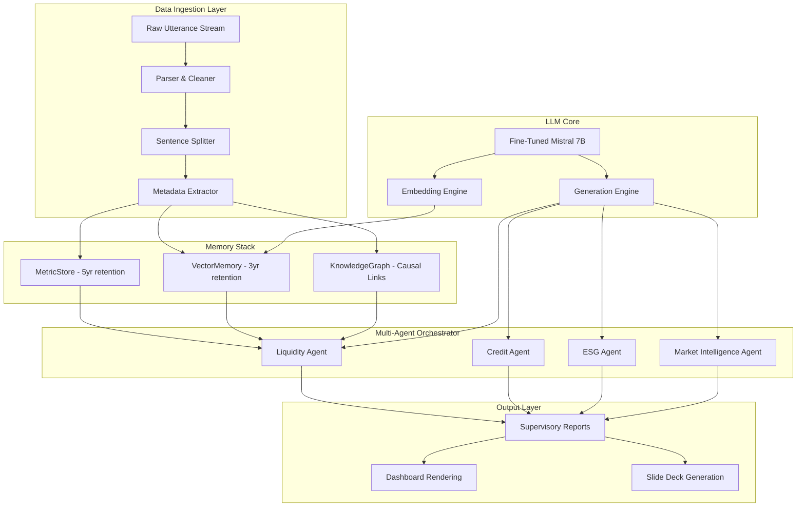

# Bank of England Mosaic Lens v2.3.0 Architecture Roadmap

## 🚀 Full System with Memory Stack & Fine-Tuned LLM Integration

**Target Version**: 2.3.0  
**Planned Release**: Q3 2025  
**Architecture Type**: Multi-Agent Orchestrator with Memory Stack

## 🎯 Vision Statement

Transform the Bank of England Mosaic Lens into a comprehensive financial intelligence platform with:
- **Memory Stack Architecture** - Persistent metric storage, vector memory, and knowledge graphs
- **Fine-Tuned LLM Integration** - 7B Mistral model specialized for financial analysis
- **Multi-Agent Orchestrator** - Specialized agents for liquidity, credit, ESG, and market intelligence
- **Automated Report Generation** - Supervisory reports with narrative intelligence

## 🏗️ System Architecture Overview



## 📊 Component Specifications

### 1. Memory Stack Architecture

#### MetricStore (5-year retention)
```python
class MetricStore:
    """Persistent storage for quantitative financial metrics"""
    
    def __init__(self, db_connection, retention_years=5):
        self.db = db_connection
        self.retention = retention_years
    
    def write_metric(self, bank: str, metric_name: str, date: datetime, value: float):
        """Store financial metrics with metadata"""
        pass
    
    def query_peer_benchmarks(self, peers: List[str], metric: str, date_range: Tuple):
        """Retrieve peer comparison data"""
        pass
    
    def get_time_series(self, bank: str, metric: str, period: str):
        """Get historical metric trends"""
        pass
```

#### VectorMemory (3-year retention)
```python
class VectorMemory:
    """Semantic search and embedding storage"""
    
    def __init__(self, vector_index, retention_years=3):
        self.index = vector_index
        self.retention = retention_years
    
    def index_sentence(self, metadata: Dict, embedding: np.ndarray):
        """Index sentence embeddings with metadata"""
        pass
    
    def semantic_search(self, query_embedding: np.ndarray, top_k: int, filters: Dict):
        """Semantic similarity search"""
        pass
    
    def get_contextual_examples(self, topic: str, bank: str, date_range: Tuple):
        """Retrieve relevant contextual examples"""
        pass
```

#### KnowledgeGraph (Causal relationships)
```python
class KnowledgeGraph:
    """Causal relationship and event tracking"""
    
    def __init__(self, graph_db):
        self.graph = graph_db
    
    def record_event(self, event_type: str, bank: str, date: datetime, details: Dict):
        """Record significant events"""
        pass
    
    def record_causal_link(self, cause_id: str, effect_id: str, relation: str):
        """Establish causal relationships"""
        pass
    
    def query_causal_path(self, event_id: str, depth: int):
        """Trace causal chains"""
        pass
```

### 2. Fine-Tuned LLM Integration

#### Mistral 7B Financial Specialist
```python
class FinancialLLM:
    """Fine-tuned Mistral 7B for financial analysis"""
    
    def __init__(self, model_path: str):
        self.model = load_fine_tuned_mistral(model_path)
    
    def embed_query(self, text: str) -> np.ndarray:
        """Generate embeddings for semantic search"""
        pass
    
    def generate_narrative(self, prompt: str, context: Dict) -> str:
        """Generate financial narratives"""
        pass
    
    def analyze_risk_factors(self, data: Dict) -> Dict:
        """Specialized risk analysis"""
        pass
```

### 3. Multi-Agent Orchestrator

#### Liquidity Agent
```python
class LiquidityAgent:
    """Specialized agent for liquidity risk analysis"""
    
    def __init__(self, metric_store, vector_memory, knowledge_graph, llm):
        self.metrics = metric_store
        self.memory = vector_memory
        self.graph = knowledge_graph
        self.llm = llm
    
    def analyze_liquidity_risk(self, bank: str, quarter: str, date_range: Tuple):
        """Comprehensive liquidity analysis"""
        # Quantitative benchmarks
        benchmarks = self.metrics.query_peer_benchmarks(
            peers=get_peer_banks(bank), 
            metric="NPL_Ratio", 
            date_range=date_range
        )
        
        # Semantic examples
        topic_embedding = self.llm.embed_query("liquidity risk stress testing")
        examples = self.memory.semantic_search(
            topic_embedding, 
            top_k=5, 
            filters={"bank": bank, "date__range": date_range}
        )
        
        # Causal analysis
        alerts = self.graph.query_events(bank, "LIQUIDITY_ALERT", date_range)
        causal_paths = {
            alert.id: self.graph.query_causal_path(alert.id, depth=3) 
            for alert in alerts
        }
        
        # Generate narrative
        prompt = self._format_liquidity_prompt(bank, benchmarks, examples, causal_paths)
        narrative = self.llm.generate_narrative(prompt, context={
            "bank": bank,
            "quarter": quarter,
            "analysis_type": "liquidity"
        })
        
        return {
            "benchmarks": benchmarks,
            "examples": examples,
            "causal_paths": causal_paths,
            "narrative": narrative,
            "risk_score": self._calculate_liquidity_risk_score(benchmarks, alerts)
        }
```

#### Credit Agent
```python
class CreditAgent:
    """Specialized agent for credit risk analysis"""
    
    def analyze_credit_risk(self, bank: str, quarter: str, date_range: Tuple):
        """Comprehensive credit risk assessment"""
        # Credit metrics analysis
        credit_metrics = self.metrics.get_credit_portfolio_metrics(bank, date_range)
        
        # Semantic analysis of credit discussions
        credit_embedding = self.llm.embed_query("credit risk provisioning loan losses")
        credit_examples = self.memory.semantic_search(
            credit_embedding,
            top_k=10,
            filters={"bank": bank, "topic": "credit", "date__range": date_range}
        )
        
        # Credit event analysis
        credit_events = self.graph.query_events(bank, "CREDIT_EVENT", date_range)
        
        # Generate credit narrative
        narrative = self.llm.generate_narrative(
            self._format_credit_prompt(credit_metrics, credit_examples, credit_events),
            context={"analysis_type": "credit", "bank": bank}
        )
        
        return {
            "metrics": credit_metrics,
            "examples": credit_examples,
            "events": credit_events,
            "narrative": narrative
        }
```

#### ESG Agent
```python
class ESGAgent:
    """Specialized agent for ESG and climate risk analysis"""
    
    def analyze_esg_factors(self, bank: str, quarter: str, date_range: Tuple):
        """Comprehensive ESG analysis"""
        # ESG metrics
        esg_metrics = self.metrics.get_esg_metrics(bank, date_range)
        
        # Climate risk discussions
        climate_embedding = self.llm.embed_query("climate risk transition physical risk")
        climate_examples = self.memory.semantic_search(
            climate_embedding,
            top_k=8,
            filters={"bank": bank, "topic": "climate", "date__range": date_range}
        )
        
        # ESG events and commitments
        esg_events = self.graph.query_events(bank, "ESG_COMMITMENT", date_range)
        
        # Generate ESG narrative
        narrative = self.llm.generate_narrative(
            self._format_esg_prompt(esg_metrics, climate_examples, esg_events),
            context={"analysis_type": "esg", "bank": bank}
        )
        
        return {
            "metrics": esg_metrics,
            "climate_examples": climate_examples,
            "events": esg_events,
            "narrative": narrative
        }
```

## 🔄 Core Processing Pipeline

### 1. Ingestion & Indexing Loop
```python
def process_utterance_stream():
    """Main processing loop for incoming data"""
    
    for record in raw_utterance_stream:
        # Parse and clean
        sentences = clean_and_split(parse_file(record))
        
        # Store metrics if present
        if record.has_metric:
            metric_store.write_metric(
                record.bank, 
                record.metric_name, 
                record.date, 
                record.value
            )
        
        # Index embeddings
        embeddings = llm.embed(sentences.text)
        for sentence, embedding in zip(sentences, embeddings):
            vector_memory.index_sentence(
                metadata=sentence.metadata, 
                embedding=embedding
            )
        
        # Record events and causal links
        if record.is_alert:
            event_id = knowledge_graph.record_event(
                record.type, 
                record.bank, 
                record.date, 
                record.details
            )
            
            for cause in record.causes:
                knowledge_graph.record_causal_link(
                    cause.id, 
                    event_id, 
                    cause.relation
                )
```

### 2. Report Generation Pipeline
```python
def generate_supervisory_report(bank: str, quarter: str):
    """Generate comprehensive supervisory report"""
    
    date_range = quarter_to_dates(quarter)
    
    # Invoke specialized agents
    liquidity_analysis = liquidity_agent.analyze_liquidity_risk(bank, quarter, date_range)
    credit_analysis = credit_agent.analyze_credit_risk(bank, quarter, date_range)
    esg_analysis = esg_agent.analyze_esg_factors(bank, quarter, date_range)
    market_analysis = market_intelligence_agent.analyze_market_position(bank, quarter, date_range)
    
    # Compile comprehensive report
    report = {
        "bank": bank,
        "quarter": quarter,
        "generation_date": datetime.now(),
        "executive_summary": generate_executive_summary(
            liquidity_analysis, credit_analysis, esg_analysis, market_analysis
        ),
        "sections": {
            "liquidity": liquidity_analysis,
            "credit": credit_analysis,
            "esg": esg_analysis,
            "market_intelligence": market_analysis
        },
        "risk_dashboard": compile_risk_dashboard(
            liquidity_analysis, credit_analysis, esg_analysis
        ),
        "recommendations": generate_supervisory_recommendations(
            liquidity_analysis, credit_analysis, esg_analysis, market_analysis
        )
    }
    
    return report
```

## 🛠️ Implementation Roadmap

### Phase 1: Memory Stack Foundation (Weeks 1-4)
- [ ] Implement MetricStore with PostgreSQL backend
- [ ] Build VectorMemory with Pinecone/Weaviate integration
- [ ] Create KnowledgeGraph with Neo4j
- [ ] Develop data ingestion pipeline
- [ ] Create retention and maintenance jobs

### Phase 2: LLM Integration (Weeks 5-8)
- [ ] Fine-tune Mistral 7B on financial corpus
- [ ] Implement embedding generation pipeline
- [ ] Build narrative generation system
- [ ] Create prompt engineering framework
- [ ] Develop LLM evaluation metrics

### Phase 3: Multi-Agent System (Weeks 9-12)
- [ ] Implement Liquidity Agent
- [ ] Build Credit Agent
- [ ] Create ESG Agent
- [ ] Enhance Market Intelligence Agent
- [ ] Develop agent orchestration system

### Phase 4: Report Generation (Weeks 13-16)
- [ ] Build report compilation engine
- [ ] Create dashboard rendering system
- [ ] Implement slide deck generation
- [ ] Develop export and sharing capabilities
- [ ] Create supervisory workflow integration

### Phase 5: Testing & Deployment (Weeks 17-20)
- [ ] Comprehensive system testing
- [ ] Performance optimization
- [ ] Security and compliance validation
- [ ] User acceptance testing
- [ ] Production deployment

## 📊 Technical Specifications

### Infrastructure Requirements
- **Compute**: 4x GPU nodes (A100/H100) for LLM inference
- **Storage**: 10TB for metric storage, 5TB for vector indices
- **Memory**: 512GB RAM for real-time processing
- **Network**: High-bandwidth for real-time data feeds

### Performance Targets
- **Ingestion Rate**: 10,000 documents/hour
- **Query Response**: <2 seconds for semantic search
- **Report Generation**: <5 minutes for full supervisory report
- **System Availability**: 99.9% uptime

### Security & Compliance
- **Data Encryption**: End-to-end encryption for all data
- **Access Control**: Role-based access with audit trails
- **Compliance**: SOX, GDPR, PCI-DSS compliance
- **Monitoring**: Real-time security monitoring and alerting

## 🎯 Success Metrics

### Quantitative Metrics
- **Analysis Accuracy**: >95% accuracy in risk identification
- **Processing Speed**: 300% improvement over manual analysis
- **Coverage**: 100% of G-SIB institutions monitored
- **User Adoption**: 90% supervisor adoption rate

### Qualitative Metrics
- **Narrative Quality**: Human-level financial analysis narratives
- **Insight Generation**: Novel insights not available through manual analysis
- **Decision Support**: Improved supervisory decision-making quality
- **Regulatory Compliance**: Full compliance with BoE requirements

---

**Architecture Roadmap Version**: 2.3.0  
**Target Release**: Q3 2025  
**Complexity**: Enterprise-scale financial intelligence platform  
**Status**: Ready for development planning