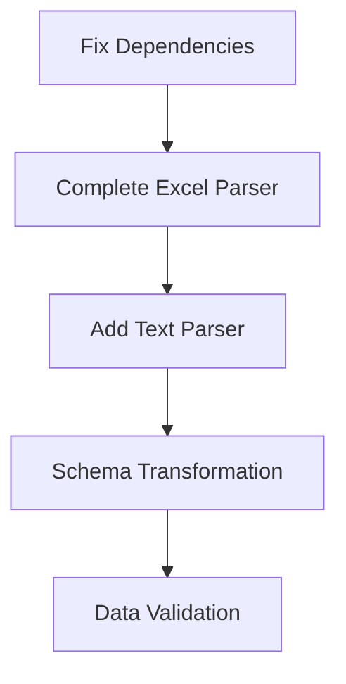
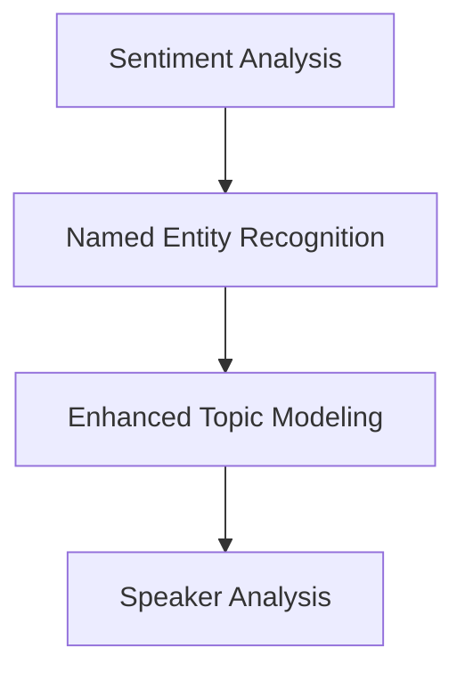
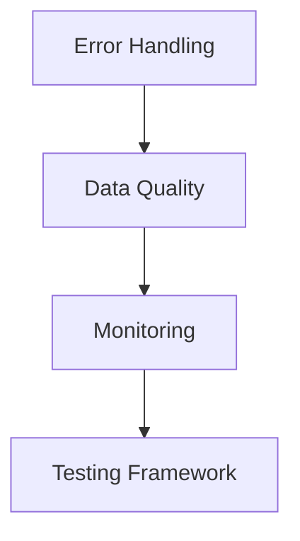
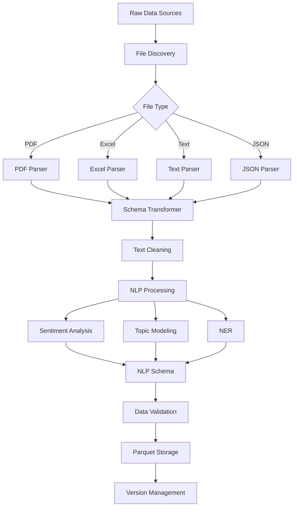
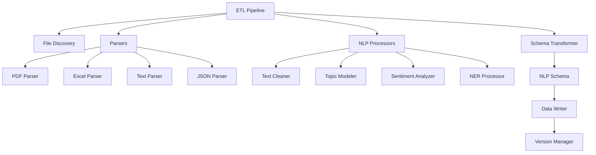

# ETL Pipeline Implementation Plan

## Executive Summary

This document outlines the comprehensive implementation plan for completing the ETL pipeline that extracts unstructured data from PDFs, spreadsheets, and transcript documents, converting them into structured data tables with prescribed schema for NLP analysis.

## Current System Assessment

### ✅ Complete Components

1. **Configuration Management** ([`config/etl_config.yaml`](config/etl_config.yaml))
   - Comprehensive configuration for banks, processing, logging, and performance
   - Support for multiple file types (PDF, XLSX, TXT, JSON)

2. **NLP Schema** ([`src/etl/nlp_schema.py`](src/etl/nlp_schema.py))
   - Well-defined PyArrow schema optimized for NLP analysis
   - Includes sentiment analysis, topic modeling, and metadata fields
   - Parquet-based storage with partitioning

3. **File Discovery** ([`src/etl/file_discovery.py`](src/etl/file_discovery.py))
   - Flexible file discovery supporting multiple directory structures
   - Automatic document type inference (transcript, presentation, supplement)
   - Bank name detection from common financial institutions

4. **PDF Parser** ([`src/etl/parsers/pdf_parser.py`](src/etl/parsers/pdf_parser.py))
   - Uses PyPDF2 and pdfplumber for robust text extraction
   - Document type inference from filename
   - Metadata extraction

5. **Text Cleaning** ([`src/etl/text_cleaning.py`](src/etl/text_cleaning.py))
   - Advanced NLP preprocessing with spaCy and NLTK
   - Financial terms preservation
   - Speaker normalization for transcripts

6. **Topic Modeling Foundation** ([`src/etl/topic_modeling.py`](src/etl/topic_modeling.py))
   - Hybrid approach using seed themes + BERTopic
   - FinBERT embeddings for financial domain

### ❌ Critical Gaps Identified

#### 1. **Missing Dependencies**
- **Issue**: [`requirements.txt`](requirements.txt) missing critical packages
- **Impact**: Pipeline fails to run due to import errors
- **Missing**: `PyPDF2`, `openpyxl`, `pyyaml`, `umap-learn`, `hdbscan`

#### 2. **Incomplete Excel Processing**
- **Issue**: [`_process_excel()`](src/etl/etl_pipeline.py:440) method not implemented
- **Impact**: Excel/spreadsheet files cannot be processed
- **Gap**: No conversion from Excel data to NLP schema format

#### 3. **Missing Text File Parser**
- **Issue**: No dedicated parser for `.txt` transcript files
- **Impact**: Text transcripts processed incorrectly via PDF parser fallback
- **Gap**: No speaker identification or transcript-specific formatting

#### 4. **Schema Transformation Gap**
- **Issue**: Parsed data not properly transformed to match NLP schema
- **Impact**: Data doesn't conform to expected structure for analysis
- **Gap**: Missing sentence-level segmentation and field mapping

#### 5. **Incomplete NLP Processing**
- **Issue**: Sentiment analysis and NER referenced but not implemented
- **Impact**: Schema fields remain empty, reducing analysis value
- **Gap**: No FinBERT sentiment scoring or entity extraction

## Implementation Plan

### Phase 1: Critical Infrastructure Fixes (Week 1)



#### 1.1 Update Dependencies
**Priority**: Critical
**Effort**: 1 day

**Tasks**:
- Update [`requirements.txt`](requirements.txt) with missing packages:
  ```
  PyPDF2>=3.0.0
  openpyxl>=3.0.9
  pyyaml>=6.0
  umap-learn>=0.5.3
  hdbscan>=0.8.28
  ```
- Add version constraints for stability
- Test installation on clean environment

#### 1.2 Complete Excel Parser Implementation
**Priority**: Critical
**Effort**: 2-3 days

**Tasks**:
- Implement [`_process_excel()`](src/etl/etl_pipeline.py:440) method
- Create Excel-to-NLP schema transformation
- Handle multi-sheet financial supplements
- Extract numerical data and convert to text descriptions
- Add error handling for corrupted Excel files

**Deliverables**:
- Functional Excel processing pipeline
- Unit tests for Excel parser
- Documentation for supported Excel formats

#### 1.3 Add Dedicated Text Parser
**Priority**: High
**Effort**: 2 days

**Tasks**:
- Create [`src/etl/parsers/text_parser.py`](src/etl/parsers/text_parser.py)
- Implement speaker identification for transcripts
- Handle various text transcript formats
- Support timestamp extraction
- Integrate with existing parser framework

**Deliverables**:
- Text parser module
- Integration with file discovery system
- Support for common transcript formats

#### 1.4 Schema Transformation Layer
**Priority**: Critical
**Effort**: 3 days

**Tasks**:
- Create [`src/etl/schema_transformer.py`](src/etl/schema_transformer.py)
- Implement sentence-level segmentation
- Map parsed data to NLP schema fields
- Handle missing data gracefully
- Add data type validation

**Deliverables**:
- Schema transformation module
- Validation framework
- Error handling for malformed data

### Phase 2: NLP Enhancement (Week 2-3)



#### 2.1 Implement Sentiment Analysis
**Priority**: High
**Effort**: 3 days

**Tasks**:
- Integrate FinBERT model for financial sentiment
- Add batch processing for performance
- Implement confidence scoring
- Handle sentence-level sentiment analysis
- Store results in NLP schema format

**Deliverables**:
- Sentiment analysis module
- FinBERT integration
- Performance benchmarks

#### 2.2 Add Named Entity Recognition
**Priority**: Medium
**Effort**: 2 days

**Tasks**:
- Extract financial entities (companies, metrics, dates)
- Use spaCy's financial NER models
- Custom entity recognition for financial terms
- Store entities in schema format
- Add entity linking capabilities

**Deliverables**:
- NER processing module
- Financial entity extraction
- Entity validation framework

#### 2.3 Complete Topic Modeling
**Priority**: High
**Effort**: 2 days

**Tasks**:
- Complete BERTopic integration
- Fix single document handling
- Add topic coherence scoring
- Implement topic evolution tracking
- Optimize for financial documents

**Deliverables**:
- Complete topic modeling pipeline
- Topic quality metrics
- Performance optimization

### Phase 3: Robustness & Quality (Week 4)



#### 3.1 Enhanced Error Handling
**Priority**: High
**Effort**: 2 days

**Tasks**:
- Add retry mechanisms for failed parsing
- Implement graceful degradation
- Add detailed error logging
- Create error recovery procedures
- Add circuit breaker patterns

**Deliverables**:
- Robust error handling framework
- Error recovery mechanisms
- Comprehensive logging

#### 3.2 Data Quality Framework
**Priority**: Medium
**Effort**: 2 days

**Tasks**:
- Add data validation rules
- Implement quality metrics
- Add data profiling capabilities
- Create quality reports
- Add data lineage tracking

**Deliverables**:
- Data quality assessment tools
- Quality metrics dashboard
- Validation rule engine

#### 3.3 Comprehensive Testing
**Priority**: High
**Effort**: 3 days

**Tasks**:
- Create unit tests for all parsers
- Add integration tests for pipeline
- Performance testing framework
- Add test data generation
- Continuous integration setup

**Deliverables**:
- Complete test suite
- Performance benchmarks
- CI/CD pipeline

### Phase 4: Advanced Features (Week 5-6)

#### 4.1 Multi-format Support
**Priority**: Low
**Effort**: 3 days

**Tasks**:
- Add PowerPoint parser for presentations
- Support for HTML/web content
- Handle video transcript formats (VTT)
- Add image text extraction (OCR)

#### 4.2 Advanced Analytics
**Priority**: Low
**Effort**: 4 days

**Tasks**:
- Cross-document topic analysis
- Temporal trend analysis
- Speaker sentiment tracking
- Comparative analysis tools

## Technical Architecture

### Data Flow Diagram



### Component Dependencies



## Implementation Priorities

### Critical Path Items (Must Complete)
1. **Dependencies Fix** - Blocks all development
2. **Excel Parser** - Core functionality gap
3. **Schema Transformation** - Data quality requirement
4. **Sentiment Analysis** - Key NLP requirement

### High Priority Items
1. **Text Parser** - Improves transcript processing
2. **Topic Modeling Completion** - Core NLP feature
3. **Error Handling** - Production readiness
4. **Testing Framework** - Quality assurance

### Medium Priority Items
1. **Named Entity Recognition** - Enhanced analysis
2. **Data Quality Framework** - Operational excellence
3. **Monitoring** - Production support

## Success Criteria

### Functional Requirements
- [ ] Process PDF documents with text extraction
- [ ] Process Excel spreadsheets with data extraction
- [ ] Process text transcripts with speaker identification
- [ ] Convert all data to standardized NLP schema
- [ ] Perform sentiment analysis on text content
- [ ] Extract topics from documents
- [ ] Store results in Parquet format with versioning

### Performance Requirements
- [ ] Process 100+ documents per hour
- [ ] Handle files up to 100MB in size
- [ ] Memory usage under 4GB during processing
- [ ] 99% uptime for production pipeline

### Quality Requirements
- [ ] 95% accuracy in text extraction
- [ ] 90% accuracy in sentiment analysis
- [ ] Comprehensive error handling and logging
- [ ] Full test coverage (>80%)

## Risk Assessment

### High Risk Items
1. **BERTopic Integration** - Complex ML model with dependencies
2. **Large File Processing** - Memory and performance constraints
3. **Financial Domain Accuracy** - Specialized NLP requirements

### Mitigation Strategies
1. **Incremental Implementation** - Build and test components separately
2. **Performance Testing** - Early identification of bottlenecks
3. **Domain Expert Review** - Validate financial NLP accuracy

## Resource Requirements

### Development Team
- **1 Senior Python Developer** - Core pipeline development
- **1 NLP Engineer** - Sentiment analysis and topic modeling
- **1 Data Engineer** - Schema design and data quality

### Infrastructure
- **Development Environment** - Python 3.8+, 16GB RAM minimum
- **Testing Environment** - Automated CI/CD pipeline
- **Production Environment** - Scalable compute resources

## Timeline Summary

| Phase | Duration | Key Deliverables |
|-------|----------|------------------|
| Phase 1 | Week 1 | Critical infrastructure fixes |
| Phase 2 | Week 2-3 | Complete NLP processing |
| Phase 3 | Week 4 | Quality and robustness |
| Phase 4 | Week 5-6 | Advanced features |

**Total Estimated Duration**: 6 weeks

## Next Steps

1. **Immediate Actions** (This Week):
   - Fix dependency issues in [`requirements.txt`](requirements.txt)
   - Begin Excel parser implementation
   - Set up development environment

2. **Week 1 Goals**:
   - Complete all Phase 1 deliverables
   - Begin Phase 2 planning
   - Establish testing framework

3. **Success Metrics**:
   - All critical path items completed
   - Pipeline processes sample data end-to-end
   - Quality metrics meet defined thresholds

---

*This implementation plan provides a roadmap for completing the ETL pipeline. Regular reviews and adjustments should be made based on progress and emerging requirements.*