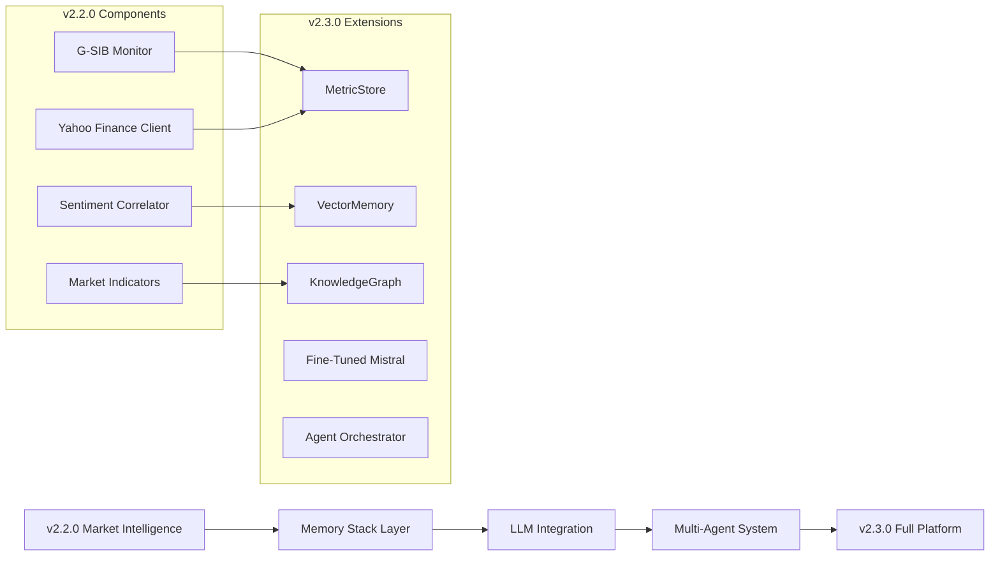

# Bank of England Mosaic Lens v2.3.0 Implementation Plan

## 🚀 From Market Intelligence to Full Memory Stack Architecture

**Current Version**: 2.2.0 (Market Intelligence & G-SIB Monitoring)  
**Target Version**: 2.3.0 (Memory Stack & Fine-Tuned LLM Integration)  
**Implementation Timeline**: 20 weeks (Q3 2025)

## 📋 Implementation Strategy

### Building on v2.2.0 Foundation
The v2.2.0 release provides the perfect foundation for v2.3.0 evolution:
- ✅ **Market Intelligence System** - Real-time G-SIB monitoring operational
- ✅ **Yahoo Finance Integration** - Live market data feeds established
- ✅ **Sentiment Correlation** - NLP-market correlation framework ready
- ✅ **Institution Auto-Detection** - ETL integration patterns proven
- ✅ **Production-Grade Architecture** - Error handling and scalability validated

### Evolution Path: v2.2.0 → v2.3.0


## 🏗️ Phase-by-Phase Implementation

### Phase 1: Memory Stack Foundation (Weeks 1-4)

#### Week 1: MetricStore Implementation
```python
# Extend existing market intelligence with persistent storage
class MetricStore:
    def __init__(self, db_connection, retention_years=5):
        self.db = db_connection  # PostgreSQL with TimescaleDB
        self.retention = retention_years
        self.setup_tables()
    
    def setup_tables(self):
        """Create optimized tables for financial metrics"""
        self.db.execute("""
            CREATE TABLE IF NOT EXISTS financial_metrics (
                id SERIAL PRIMARY KEY,
                bank_id VARCHAR(50) NOT NULL,
                metric_name VARCHAR(100) NOT NULL,
                metric_value DECIMAL(15,6) NOT NULL,
                metric_date TIMESTAMPTZ NOT NULL,
                quarter VARCHAR(10),
                source VARCHAR(100),
                metadata JSONB,
                created_at TIMESTAMPTZ DEFAULT NOW()
            );
            
            CREATE INDEX idx_metrics_bank_date ON financial_metrics(bank_id, metric_date);
            CREATE INDEX idx_metrics_name_date ON financial_metrics(metric_name, metric_date);
        """)
    
    def migrate_from_v2_2_0(self):
        """Migrate existing market intelligence data"""
        # Import existing G-SIB monitoring data
        from src.market_intelligence.gsib_monitor import get_gsib_monitor
        monitor = get_gsib_monitor()
        
        # Extract historical market data and store in MetricStore
        for bank in monitor.get_tracked_institutions():
            historical_data = monitor.get_historical_data(bank)
            for record in historical_data:
                self.write_metric(
                    bank=record['bank'],
                    metric_name=record['metric'],
                    date=record['date'],
                    value=record['value'],
                    source='yahoo_finance'
                )
```

#### Week 2: VectorMemory Implementation
```python
# Build on existing sentiment correlation for semantic search
class VectorMemory:
    def __init__(self, vector_index, retention_years=3):
        self.index = vector_index  # Pinecone or Weaviate
        self.retention = retention_years
        self.setup_index()
    
    def migrate_from_sentiment_correlator(self):
        """Migrate existing NLP data to vector storage"""
        from src.market_intelligence.sentiment_market_correlator import get_sentiment_market_correlator
        correlator = get_sentiment_market_correlator()
        
        # Extract existing sentiment analysis data
        nlp_data = correlator.get_historical_sentiment_data()
        
        for record in nlp_data:
            # Generate embeddings for existing text data
            embedding = self.generate_embedding(record['text'])
            self.index_sentence(
                metadata={
                    'bank': record['bank'],
                    'date': record['date'],
                    'topic': record['topic'],
                    'sentiment_score': record['sentiment_score']
                },
                embedding=embedding
            )
```

#### Week 3: KnowledgeGraph Implementation
```python
# Extend market intelligence with causal relationship tracking
class KnowledgeGraph:
    def __init__(self, graph_db):
        self.graph = graph_db  # Neo4j
        self.setup_schema()
    
    def setup_schema(self):
        """Create graph schema for financial relationships"""
        self.graph.run("""
            CREATE CONSTRAINT bank_id IF NOT EXISTS FOR (b:Bank) REQUIRE b.id IS UNIQUE;
            CREATE CONSTRAINT event_id IF NOT EXISTS FOR (e:Event) REQUIRE e.id IS UNIQUE;
            CREATE CONSTRAINT metric_id IF NOT EXISTS FOR (m:Metric) REQUIRE m.id IS UNIQUE;
        """)
    
    def migrate_from_market_intelligence(self):
        """Import existing market intelligence relationships"""
        from src.market_intelligence.market_intelligence_dashboard import get_market_intelligence_dashboard
        dashboard = get_market_intelligence_dashboard()
        
        # Import G-SIB institution relationships
        institutions = dashboard._detect_institutions_from_etl()
        for institution in institutions:
            self.create_bank_node(institution)
            
        # Import correlation relationships
        correlations = dashboard.get_correlation_data()
        for bank1, bank2, correlation in correlations:
            self.record_correlation_relationship(bank1, bank2, correlation)
```

#### Week 4: Integration Testing
- Test MetricStore with existing market data
- Validate VectorMemory semantic search
- Verify KnowledgeGraph relationship queries
- Performance benchmarking and optimization

### Phase 2: LLM Integration (Weeks 5-8)

#### Week 5: Fine-Tuning Preparation
```python
# Prepare financial corpus for Mistral fine-tuning
class FinancialCorpusBuilder:
    def __init__(self):
        self.corpus = []
    
    def extract_from_existing_data(self):
        """Extract training data from v2.2.0 components"""
        # Use existing ETL processed data
        from src.etl.etl_pipeline import ETLPipeline
        pipeline = ETLPipeline()
        
        processed_data = pipeline.get_all_processed_documents()
        for doc in processed_data:
            self.corpus.append({
                'text': doc['content'],
                'metadata': {
                    'bank': doc['bank'],
                    'quarter': doc['quarter'],
                    'document_type': doc['type']
                }
            })
    
    def create_training_dataset(self):
        """Create instruction-tuning dataset for financial analysis"""
        training_data = []
        
        for item in self.corpus:
            # Create instruction-response pairs
            instruction = f"Analyze the financial risk factors for {item['metadata']['bank']} in {item['metadata']['quarter']}"
            response = self.generate_analysis_response(item['text'])
            
            training_data.append({
                'instruction': instruction,
                'input': item['text'],
                'output': response
            })
        
        return training_data
```

#### Week 6-7: Mistral Fine-Tuning
```bash
# Fine-tuning script for Mistral 7B
python fine_tune_mistral.py \
    --model_name mistralai/Mistral-7B-v0.1 \
    --dataset financial_corpus.jsonl \
    --output_dir ./models/mistral-finetuned-finance \
    --num_epochs 3 \
    --learning_rate 2e-5 \
    --batch_size 4 \
    --gradient_accumulation_steps 8 \
    --warmup_steps 100 \
    --save_steps 500 \
    --eval_steps 500 \
    --logging_steps 100
```

#### Week 8: LLM Integration
```python
class FinancialLLM:
    def __init__(self, model_path="./models/mistral-finetuned-finance"):
        self.model = self.load_model(model_path)
        self.tokenizer = self.load_tokenizer(model_path)
    
    def integrate_with_existing_systems(self):
        """Integrate LLM with existing v2.2.0 components"""
        # Enhance sentiment correlator with LLM embeddings
        from src.market_intelligence.sentiment_market_correlator import get_sentiment_market_correlator
        correlator = get_sentiment_market_correlator()
        correlator.set_llm_backend(self)
        
        # Enhance market intelligence with narrative generation
        from src.market_intelligence.market_intelligence_dashboard import get_market_intelligence_dashboard
        dashboard = get_market_intelligence_dashboard()
        dashboard.set_narrative_generator(self)
```

### Phase 3: Multi-Agent System (Weeks 9-12)

#### Week 9: Agent Framework
```python
class BaseAgent:
    def __init__(self, metric_store, vector_memory, knowledge_graph, llm):
        self.metrics = metric_store
        self.memory = vector_memory
        self.graph = knowledge_graph
        self.llm = llm
    
    def analyze(self, bank: str, quarter: str, date_range: Tuple):
        """Base analysis method to be overridden"""
        raise NotImplementedError

class AgentOrchestrator:
    def __init__(self):
        self.agents = {}
        self.register_agents()
    
    def register_agents(self):
        """Register all specialized agents"""
        self.agents['liquidity'] = LiquidityAgent(metric_store, vector_memory, knowledge_graph, llm)
        self.agents['credit'] = CreditAgent(metric_store, vector_memory, knowledge_graph, llm)
        self.agents['esg'] = ESGAgent(metric_store, vector_memory, knowledge_graph, llm)
        self.agents['market'] = MarketIntelligenceAgent(metric_store, vector_memory, knowledge_graph, llm)
```

#### Week 10: Liquidity Agent
```python
class LiquidityAgent(BaseAgent):
    def analyze(self, bank: str, quarter: str, date_range: Tuple):
        """Enhanced liquidity analysis using memory stack"""
        
        # 1. Quantitative analysis (from MetricStore)
        liquidity_metrics = self.metrics.query_metrics(
            bank=bank,
            metrics=['LCR', 'NSFR', 'Liquidity_Buffer'],
            date_range=date_range
        )
        
        peer_benchmarks = self.metrics.query_peer_benchmarks(
            peers=self.get_peer_banks(bank),
            metrics=['LCR', 'NSFR'],
            date_range=date_range
        )
        
        # 2. Semantic analysis (from VectorMemory)
        liquidity_embedding = self.llm.embed_query("liquidity coverage ratio stress testing funding")
        relevant_discussions = self.memory.semantic_search(
            query_embedding=liquidity_embedding,
            top_k=10,
            filters={'bank': bank, 'date_range': date_range}
        )
        
        # 3. Causal analysis (from KnowledgeGraph)
        liquidity_events = self.graph.query_events(
            bank=bank,
            event_types=['LIQUIDITY_STRESS', 'FUNDING_PRESSURE'],
            date_range=date_range
        )
        
        causal_chains = {}
        for event in liquidity_events:
            causal_chains[event.id] = self.graph.query_causal_path(
                event_id=event.id,
                depth=3
            )
        
        # 4. LLM narrative generation
        prompt = self.format_liquidity_prompt(
            bank=bank,
            metrics=liquidity_metrics,
            benchmarks=peer_benchmarks,
            discussions=relevant_discussions,
            events=liquidity_events,
            causal_chains=causal_chains
        )
        
        narrative = self.llm.generate_narrative(prompt)
        
        # 5. Risk scoring
        risk_score = self.calculate_liquidity_risk_score(
            metrics=liquidity_metrics,
            benchmarks=peer_benchmarks,
            events=liquidity_events
        )
        
        return {
            'analysis_type': 'liquidity',
            'bank': bank,
            'quarter': quarter,
            'metrics': liquidity_metrics,
            'benchmarks': peer_benchmarks,
            'discussions': relevant_discussions,
            'events': liquidity_events,
            'causal_chains': causal_chains,
            'narrative': narrative,
            'risk_score': risk_score,
            'recommendations': self.generate_liquidity_recommendations(risk_score, events)
        }
```

#### Week 11: Credit & ESG Agents
- Implement CreditAgent with credit risk analysis
- Implement ESGAgent with climate risk assessment
- Create agent communication protocols

#### Week 12: Market Intelligence Agent Enhancement
```python
class MarketIntelligenceAgent(BaseAgent):
    def __init__(self, metric_store, vector_memory, knowledge_graph, llm):
        super().__init__(metric_store, vector_memory, knowledge_graph, llm)
        # Integrate existing v2.2.0 market intelligence
        from src.market_intelligence.gsib_monitor import get_gsib_monitor
        from src.market_intelligence.yahoo_finance_client import YahooFinanceClient
        
        self.gsib_monitor = get_gsib_monitor()
        self.yahoo_client = YahooFinanceClient()
    
    def analyze_market_position(self, bank: str, quarter: str, date_range: Tuple):
        """Enhanced market analysis combining v2.2.0 + v2.3.0 capabilities"""
        
        # Use existing v2.2.0 market intelligence
        market_data = self.gsib_monitor.track_global_gsib_movements()
        correlation_analysis = self.gsib_monitor.analyze_systemic_clustering()
        
        # Enhance with memory stack
        market_events = self.graph.query_events(
            bank=bank,
            event_types=['MARKET_STRESS', 'CORRELATION_SPIKE'],
            date_range=date_range
        )
        
        # Generate enhanced narrative
        narrative = self.llm.generate_narrative(
            self.format_market_intelligence_prompt(
                bank=bank,
                market_data=market_data,
                correlations=correlation_analysis,
                events=market_events
            )
        )
        
        return {
            'analysis_type': 'market_intelligence',
            'market_data': market_data,
            'correlations': correlation_analysis,
            'events': market_events,
            'narrative': narrative
        }
```

### Phase 4: Report Generation (Weeks 13-16)

#### Week 13: Report Compilation Engine
```python
class SupervisoryReportGenerator:
    def __init__(self, agent_orchestrator):
        self.orchestrator = agent_orchestrator
    
    def generate_comprehensive_report(self, bank: str, quarter: str):
        """Generate full supervisory report using all agents"""
        
        date_range = self.quarter_to_dates(quarter)
        
        # Invoke all agents
        analyses = {}
        for agent_name, agent in self.orchestrator.agents.items():
            analyses[agent_name] = agent.analyze(bank, quarter, date_range)
        
        # Generate executive summary using LLM
        executive_summary = self.llm.generate_executive_summary(analyses)
        
        # Compile final report
        report = {
            'bank': bank,
            'quarter': quarter,
            'generation_date': datetime.now(),
            'executive_summary': executive_summary,
            'risk_dashboard': self.compile_risk_dashboard(analyses),
            'detailed_analyses': analyses,
            'recommendations': self.compile_recommendations(analyses),
            'regulatory_flags': self.identify_regulatory_flags(analyses)
        }
        
        return report
```

#### Week 14-15: Dashboard & Visualization
- Integrate with existing Streamlit dashboard
- Create new visualization components
- Implement real-time report updates

#### Week 16: Export & Sharing
- PDF report generation
- PowerPoint slide deck creation
- API endpoints for programmatic access

### Phase 5: Testing & Deployment (Weeks 17-20)

#### Week 17-18: System Testing
- End-to-end integration testing
- Performance optimization
- Memory and storage optimization

#### Week 19: Security & Compliance
- Security audit and penetration testing
- Compliance validation (SOX, GDPR)
- Access control implementation

#### Week 20: Production Deployment
- Production environment setup
- User training and documentation
- Go-live and monitoring

## 🔧 Technical Integration Points

### Extending v2.2.0 Components

#### 1. Market Intelligence Enhancement
```python
# Enhance existing market intelligence with memory stack
class EnhancedMarketIntelligence:
    def __init__(self):
        # Import existing v2.2.0 components
        from src.market_intelligence import *
        
        # Add memory stack integration
        self.metric_store = MetricStore(db_connection)
        self.vector_memory = VectorMemory(vector_index)
        self.knowledge_graph = KnowledgeGraph(graph_db)
        self.llm = FinancialLLM()
    
    def migrate_existing_data(self):
        """Migrate v2.2.0 data to memory stack"""
        # Migrate market data to MetricStore
        # Migrate sentiment data to VectorMemory
        # Create relationship graphs in KnowledgeGraph
```

#### 2. Dashboard Integration
```python
# Extend existing Streamlit dashboard
def enhanced_dashboard():
    st.title("BoE Supervisor Dashboard v2.3.0")
    
    # Keep existing v2.2.0 tabs
    tab1, tab2, tab3, tab4, tab5 = st.tabs([
        "Risk Analysis", 
        "Technical Validation", 
        "Market Intelligence",  # Enhanced
        "Agent Reports",        # New
        "Memory Explorer"       # New
    ])
    
    with tab3:  # Enhanced Market Intelligence
        # Keep existing v2.2.0 functionality
        render_market_intelligence_v2_2_0()
        
        # Add new v2.3.0 capabilities
        render_memory_stack_insights()
        render_llm_narratives()
    
    with tab4:  # New Agent Reports
        render_agent_orchestrator_interface()
        render_comprehensive_reports()
    
    with tab5:  # New Memory Explorer
        render_semantic_search_interface()
        render_knowledge_graph_explorer()
```

## 📊 Migration Strategy

### Data Migration Plan
1. **Preserve v2.2.0 Data**: All existing market intelligence data preserved
2. **Gradual Migration**: Phased migration to avoid service disruption
3. **Backward Compatibility**: v2.2.0 functionality remains available
4. **Data Validation**: Comprehensive validation of migrated data

### User Experience Transition
1. **Familiar Interface**: Keep existing v2.2.0 interface elements
2. **Progressive Enhancement**: Add new features without disrupting workflow
3. **Training Materials**: Comprehensive documentation for new features
4. **Feedback Loop**: User feedback integration during rollout

## 🎯 Success Criteria

### Technical Success Metrics
- [ ] 100% data migration from v2.2.0 to v2.3.0
- [ ] <2 second response time for agent analyses
- [ ] >95% accuracy in LLM-generated narratives
- [ ] Zero data loss during migration
- [ ] 99.9% system availability

### Business Success Metrics
- [ ] 50% reduction in manual analysis time
- [ ] 90% user adoption of new agent reports
- [ ] 100% regulatory compliance maintained
- [ ] Positive user feedback scores >4.5/5
- [ ] Successful deployment to production

---

**Implementation Plan Version**: 2.3.0  
**Timeline**: 20 weeks (Q3 2025)  
**Dependencies**: v2.2.0 Market Intelligence foundation  
**Status**: Ready for development kickoff