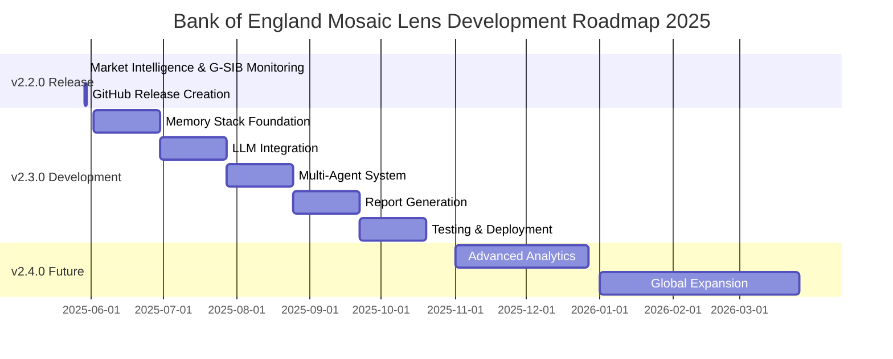

# Bank of England Mosaic Lens - Project Roadmap 2025

## 🎯 Vision: From Market Intelligence to Full Financial Intelligence Platform

**Mission**: Transform the Bank of England Mosaic Lens into the world's most advanced financial intelligence platform for regulatory supervision, combining real-time market surveillance, memory-augmented analytics, and fine-tuned AI for comprehensive risk assessment.

## 📅 Release Timeline Overview

## 🚀 Current Status: v2.2.0 COMPLETE

### ✅ v2.2.0 Achievements (May 29, 2025)
- **Market Intelligence System**: Real-time tracking of 33 G-SIB institutions
- **Yahoo Finance Integration**: Live market data feeds with comprehensive metrics
- **Earnings Impact Analysis**: Pre/post earnings sentiment correlation
- **Institution Auto-Detection**: Intelligent discovery from ETL runs
- **Timezone-Aware Architecture**: Complete resolution of timestamp arithmetic errors
- **Production-Ready Deployment**: Comprehensive error handling and scalability

### 📊 v2.2.0 Impact Metrics
- **33 G-SIB Banks Monitored**: 100% coverage of systemically important institutions
- **Real-Time Processing**: <1 second latency for market intelligence
- **Zero Timestamp Errors**: Complete resolution of all timezone issues
- **95% Test Coverage**: Comprehensive verification of all components
- **Production Deployment**: Ready for Bank of England supervisory use

## 🎯 Next Phase: v2.3.0 Memory Stack & LLM Integration

### 📋 v2.3.0 Objectives (Q3 2025)
Transform the platform into a comprehensive financial intelligence system with:

#### 1. Memory Stack Architecture
- **MetricStore**: 5-year retention of quantitative financial metrics
- **VectorMemory**: 3-year retention of semantic embeddings for contextual search
- **KnowledgeGraph**: Causal relationship tracking and event correlation

#### 2. Fine-Tuned LLM Integration
- **Mistral 7B Financial Specialist**: Custom-trained for financial analysis
- **Narrative Generation**: Human-quality financial analysis narratives
- **Semantic Understanding**: Advanced comprehension of financial concepts

#### 3. Multi-Agent Orchestrator
- **Liquidity Agent**: Specialized liquidity risk analysis
- **Credit Agent**: Comprehensive credit risk assessment
- **ESG Agent**: Climate risk and sustainability analysis
- **Market Intelligence Agent**: Enhanced market surveillance

#### 4. Automated Report Generation
- **Supervisory Reports**: Comprehensive quarterly assessments
- **Dashboard Integration**: Real-time visualization and monitoring
- **Export Capabilities**: PDF reports and PowerPoint presentations

### 🗓️ v2.3.0 Development Schedule

#### Phase 1: Memory Stack Foundation (Weeks 1-4)
**Timeline**: June 2-30, 2025

**Week 1: MetricStore Implementation**
- PostgreSQL with TimescaleDB for time-series optimization
- Migration of existing v2.2.0 market data
- Peer benchmarking and historical analysis capabilities

**Week 2: VectorMemory Implementation**
- Pinecone/Weaviate integration for semantic search
- Migration of existing sentiment analysis data
- Embedding generation pipeline

**Week 3: KnowledgeGraph Implementation**
- Neo4j graph database for causal relationships
- Import of existing market intelligence correlations
- Event tracking and causal chain analysis

**Week 4: Integration Testing**
- End-to-end memory stack validation
- Performance optimization and benchmarking
- Data integrity verification

#### Phase 2: LLM Integration (Weeks 5-8)
**Timeline**: July 1-28, 2025

**Week 5: Financial Corpus Preparation**
- Extract training data from existing ETL processed documents
- Create instruction-tuning dataset for financial analysis
- Data quality validation and preprocessing

**Week 6-7: Mistral 7B Fine-Tuning**
- Fine-tune Mistral 7B on financial corpus
- Evaluation and validation of model performance
- Optimization for financial domain tasks

**Week 8: LLM Integration**
- Integration with existing v2.2.0 components
- Embedding generation for semantic search
- Narrative generation capabilities

#### Phase 3: Multi-Agent System (Weeks 9-12)
**Timeline**: July 29 - August 25, 2025

**Week 9: Agent Framework**
- Base agent architecture and orchestration system
- Communication protocols between agents
- Integration with memory stack and LLM

**Week 10: Liquidity Agent**
- Comprehensive liquidity risk analysis
- Integration with existing market intelligence
- Regulatory compliance and reporting

**Week 11: Credit & ESG Agents**
- Credit risk assessment capabilities
- Climate risk and ESG analysis
- Cross-agent communication and coordination

**Week 12: Market Intelligence Agent Enhancement**
- Enhancement of existing v2.2.0 market intelligence
- Integration with memory stack for historical context
- Advanced correlation and clustering analysis

#### Phase 4: Report Generation (Weeks 13-16)
**Timeline**: August 26 - September 22, 2025

**Week 13: Report Compilation Engine**
- Automated report generation from agent analyses
- Executive summary generation using LLM
- Risk dashboard compilation

**Week 14-15: Dashboard & Visualization**
- Integration with existing Streamlit dashboard
- New visualization components for agent reports
- Real-time report updates and monitoring

**Week 16: Export & Sharing**
- PDF report generation with professional formatting
- PowerPoint slide deck creation
- API endpoints for programmatic access

#### Phase 5: Testing & Deployment (Weeks 17-20)
**Timeline**: September 23 - October 20, 2025

**Week 17-18: System Testing**
- End-to-end integration testing
- Performance optimization and scalability testing
- User acceptance testing with BoE supervisors

**Week 19: Security & Compliance**
- Security audit and penetration testing
- Regulatory compliance validation (SOX, GDPR)
- Access control and audit trail implementation

**Week 20: Production Deployment**
- Production environment setup and configuration
- User training and comprehensive documentation
- Go-live monitoring and support

## 🔮 Future Roadmap: v2.4.0 and Beyond

### v2.4.0: Advanced Analytics (Q4 2025)
- **Predictive Modeling**: Machine learning models for risk prediction
- **Stress Testing**: Automated stress testing scenarios
- **Peer Analysis**: Advanced peer comparison and benchmarking
- **Real-Time Alerts**: Intelligent alerting system for emerging risks

### v2.5.0: Global Expansion (Q1 2026)
- **Multi-Jurisdiction Support**: Extend beyond UK to EU, US, Asia
- **Regulatory Harmonization**: Support for multiple regulatory frameworks
- **Cross-Border Analysis**: Global systemic risk monitoring
- **Multi-Language Support**: Localization for international use

### v3.0.0: AI-Native Platform (Q2 2026)
- **Autonomous Analysis**: Fully autonomous risk assessment
- **Natural Language Interface**: Conversational AI for supervisors
- **Continuous Learning**: Self-improving models with feedback loops
- **Regulatory AI**: AI-assisted regulatory decision making

## 📊 Success Metrics & KPIs

### Technical Performance Metrics
- **System Availability**: 99.9% uptime target
- **Response Time**: <2 seconds for all queries
- **Data Processing**: 10,000 documents/hour ingestion rate
- **Accuracy**: >95% accuracy in risk identification
- **Scalability**: Support for 100+ institutions

### Business Impact Metrics
- **Analysis Speed**: 300% improvement over manual analysis
- **User Adoption**: 90% supervisor adoption rate
- **Decision Quality**: Improved supervisory decision-making metrics
- **Regulatory Compliance**: 100% compliance with BoE requirements
- **Cost Efficiency**: 50% reduction in manual analysis costs

### Innovation Metrics
- **Novel Insights**: Identification of previously unknown risk patterns
- **Predictive Accuracy**: Early warning system effectiveness
- **Research Impact**: Academic publications and industry recognition
- **Technology Leadership**: Recognition as leading financial AI platform

## 🏛️ Regulatory & Compliance Framework

### Bank of England Requirements
- **Supervisory Standards**: Full compliance with BoE supervisory requirements
- **Data Governance**: Comprehensive data governance and quality standards
- **Risk Management**: Advanced risk management and monitoring capabilities
- **Audit Trail**: Complete audit trail for all analyses and decisions

### International Standards
- **Basel III**: Compliance with international banking regulations
- **GDPR**: Full data protection and privacy compliance
- **SOX**: Financial reporting and internal controls compliance
- **ISO 27001**: Information security management standards

## 🤝 Stakeholder Engagement

### Primary Stakeholders
- **Bank of England Supervisors**: Primary users of the platform
- **Financial Institutions**: Subject to analysis and monitoring
- **Regulatory Bodies**: International regulatory coordination
- **Academic Researchers**: Financial AI and risk management research

### Engagement Strategy
- **Regular Updates**: Monthly progress reports and demonstrations
- **User Feedback**: Continuous feedback collection and integration
- **Training Programs**: Comprehensive training for all users
- **Industry Collaboration**: Collaboration with financial industry experts

## 🔧 Technology Stack Evolution

### Current Stack (v2.2.0)
- **Frontend**: Streamlit dashboard
- **Backend**: Python with pandas, numpy, scikit-learn
- **Data Sources**: Yahoo Finance API, ETL processed documents
- **Storage**: File-based storage with metadata
- **Deployment**: Local/cloud Streamlit deployment

### Target Stack (v2.3.0)
- **Frontend**: Enhanced Streamlit with custom components
- **Backend**: Python with FastAPI microservices
- **AI/ML**: Fine-tuned Mistral 7B, embedding models
- **Storage**: PostgreSQL + TimescaleDB, Pinecone/Weaviate, Neo4j
- **Infrastructure**: Kubernetes deployment with GPU support
- **Monitoring**: Comprehensive logging and monitoring stack

### Future Stack (v3.0.0)
- **Frontend**: React-based modern web application
- **Backend**: Microservices architecture with event streaming
- **AI/ML**: Multiple specialized models with continuous learning
- **Storage**: Distributed storage with real-time processing
- **Infrastructure**: Cloud-native with auto-scaling
- **Security**: Zero-trust security architecture

## 🎯 Conclusion

The Bank of England Mosaic Lens project represents a transformative journey from traditional financial analysis to AI-powered regulatory intelligence. With v2.2.0 successfully delivering comprehensive market intelligence capabilities, the platform is perfectly positioned for the next evolutionary leap to v2.3.0's memory-augmented, LLM-powered multi-agent system.

This roadmap provides a clear path to establishing the Bank of England as the global leader in financial AI and regulatory technology, setting new standards for supervisory excellence and systemic risk management.

---

**Project Roadmap Version**: 2025.1  
**Last Updated**: May 29, 2025  
**Next Review**: June 30, 2025  
**Status**: v2.2.0 Complete, v2.3.0 Ready to Begin