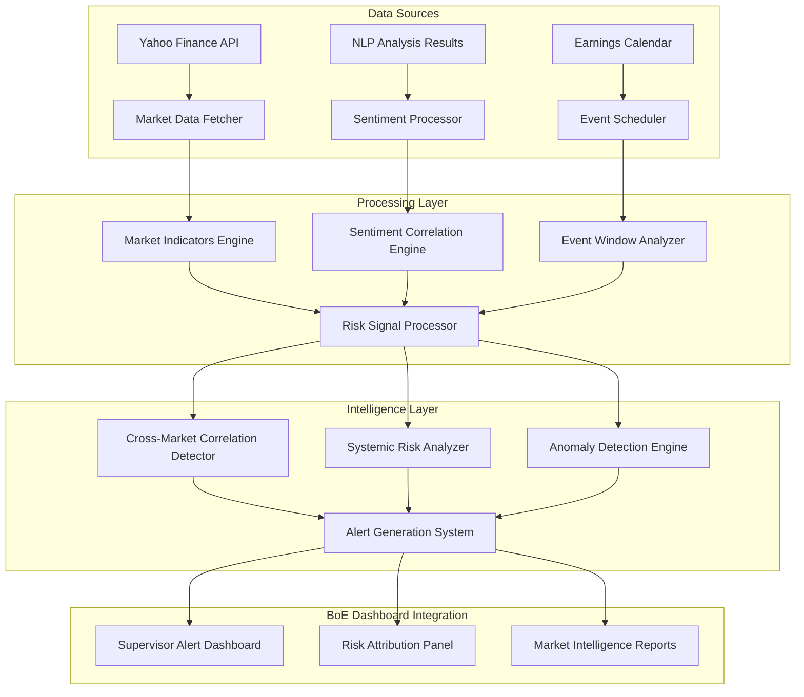

# 📊 Yahoo Finance Market Intelligence Integration
## Comprehensive Implementation Plan for BoE Mosaic Lens

**Version**: 1.0  
**Date**: May 28, 2025  
**Author**: BoE Mosaic Lens Development Team  
**Status**: Implementation Ready  

---

## 🎯 Executive Summary

This document outlines the comprehensive integration of Yahoo Finance API with the Bank of England Mosaic Lens platform to enhance market sentiment detection around earnings calls for Global Systemically Important Banks (G-SIBs). The integration will provide real-time market intelligence, cross-market correlation analysis, and systemic risk indicators to support BoE supervisory decision-making.

### Key Objectives
- **Market Sentiment Correlation**: Align NLP-derived sentiment with real-time market movements
- **G-SIB Monitoring**: Track global systemically important banks with emphasis on cross-market correlations
- **Earnings Intelligence**: Detect discrepancies between management narrative and market reaction
- **Systemic Risk Detection**: Identify potential contagion patterns and systemic vulnerabilities
- **Regulatory Intelligence**: Generate actionable insights for BoE supervisors

---

## 🏗️ System Architecture Overview

```
┌─────────────────────────────────────────────────────────────────┐
│                    BoE Mosaic Lens Platform                     │
├─────────────────────────────────────────────────────────────────┤
│  ┌─────────────────┐  ┌─────────────────┐  ┌─────────────────┐ │
│  │   NLP Engine    │  │ Market Intel    │  │ Risk Analytics  │ │
│  │                 │  │                 │  │                 │ │
│  │ • Sentiment     │  │ • Yahoo Finance │  │ • Correlation   │ │
│  │ • Topic Model   │  │ • Market Data   │  │ • Anomaly Det   │ │
│  │ • Contradiction │  │ • G-SIB Monitor │  │ • Alert System  │ │
│  └─────────────────┘  └─────────────────┘  └─────────────────┘ │
├─────────────────────────────────────────────────────────────────┤
│                    Integration Layer                            │
├─────────────────────────────────────────────────────────────────┤
│  ┌─────────────────┐  ┌─────────────────┐  ┌─────────────────┐ │
│  │ Data Processor  │  │ Event Scheduler │  │ Alert Manager   │ │
│  └─────────────────┘  └─────────────────┘  └─────────────────┘ │
├─────────────────────────────────────────────────────────────────┤
│                    BoE Supervisor Dashboard                     │
└─────────────────────────────────────────────────────────────────┘
```

---

## 📋 Implementation Phases

### Phase 1: Core Market Data Integration (Week 1-2)

#### 1.1 Yahoo Finance API Client
**File**: `src/market_intelligence/yahoo_finance_client.py`

**Features**:
- Multi-interval data fetching (1m, 5m, 1h, 1d)
- Rate limiting and error handling
- Earnings calendar integration
- Options data for volatility analysis
- Institutional holdings tracking

**Key Methods**:
```python
class YahooFinanceClient:
    def fetch_market_data(ticker, period="6mo", interval="1d")
    def get_earnings_calendar(ticker, start_date, end_date)
    def fetch_options_data(ticker, expiry_date)
    def get_institutional_holdings(ticker)
    def fetch_historical_volatility(ticker, window=30)
```

#### 1.2 G-SIB Institution Configuration
**File**: `config/gsib_institutions.yaml`

**Content Structure**:
```yaml
global_gsibs:
  us_banks:
    - ticker: "JPM"
      name: "JPMorgan Chase"
      market_cap_tier: 1
      systemic_weight: 0.25
    - ticker: "BAC"
      name: "Bank of America"
      market_cap_tier: 1
      systemic_weight: 0.20
  european_banks:
    - ticker: "DB"
      name: "Deutsche Bank"
      market_cap_tier: 2
      systemic_weight: 0.15
```

#### 1.3 Market Indicators Engine
**File**: `src/market_intelligence/market_indicators.py`

**Indicators**:
- Price volatility (rolling standard deviation)
- Volume anomalies (vs. average volume)
- Technical indicators (RSI, MACD, Bollinger Bands)
- Momentum indicators
- Liquidity metrics

### Phase 2: NLP-Market Correlation Engine (Week 3-4)

#### 2.1 Sentiment-Market Correlator
**File**: `src/market_intelligence/sentiment_market_correlator.py`

**Core Functionality**:
```python
class SentimentMarketCorrelator:
    def align_nlp_with_market_data(nlp_df, market_df)
    def calculate_correlation_coefficients(sentiment_scores, returns)
    def detect_sentiment_market_divergence(threshold=0.3)
    def generate_correlation_significance_tests()
```

#### 2.2 Event Window Analysis
**File**: `src/market_intelligence/earnings_event_analyzer.py`

**Event Windows**:
- **Pre-earnings**: 5 trading days before
- **During-earnings**: Intraday during call (15-minute intervals)
- **Post-earnings**: 3 trading days after
- **Extended analysis**: 2 weeks pre/post for trend detection

#### 2.3 Cross-Market Correlation Detection
**File**: `src/market_intelligence/cross_market_analyzer.py`

**Analysis Types**:
- Sector-wide movement correlation
- G-SIB interconnectedness mapping
- Contagion pattern detection
- Regional market spillover effects

### Phase 3: Systemic Risk Intelligence (Week 5-6)

#### 3.1 Systemic Risk Indicators
**File**: `src/market_intelligence/systemic_risk_analyzer.py`

**Risk Metrics**:
- Cross-institutional correlation spikes
- Volatility clustering analysis
- Liquidity stress indicators
- Market concentration risk

#### 3.2 Anomaly Detection System
**File**: `src/market_intelligence/anomaly_detector.py`

**Detection Methods**:
- Statistical outlier detection (2σ, 3σ thresholds)
- Machine learning-based anomaly scoring
- Pattern recognition for unusual behavior
- Time-series anomaly detection

#### 3.3 Alert Generation Framework
**File**: `src/market_intelligence/alert_system.py`

**Alert Categories**:
- **Sentiment-Market Divergence**: NLP vs. market reaction misalignment
- **Cross-G-SIB Contagion**: Unusual correlation spikes
- **Volume Anomalies**: Trading volume >3x average
- **Volatility Spikes**: Price volatility >2σ from norm
- **Systemic Risk Escalation**: Multiple G-SIBs showing stress

### Phase 4: Dashboard Integration (Week 7-8)

#### 4.1 Market Intelligence Dashboard Tab
**Integration**: Enhanced `main_dashboard.py`

**New Tab Features**:
- Real-time G-SIB monitoring panel
- Correlation heatmaps
- Earnings impact analysis
- Systemic risk alerts dashboard

#### 4.2 Enhanced Risk Attribution
**Integration**: Existing risk scoring system

**Enhancements**:
- Market signal integration into risk scores
- Market validation/contradiction of NLP findings
- Evidence trails for supervisor review

---

## 🔧 Technical Implementation Details

### Data Flow Architecture



### Database Schema Extensions

#### Market Data Tables
```sql
-- Market data storage
CREATE TABLE market_data (
    id SERIAL PRIMARY KEY,
    ticker VARCHAR(10) NOT NULL,
    date DATE NOT NULL,
    open_price DECIMAL(10,4),
    close_price DECIMAL(10,4),
    high_price DECIMAL(10,4),
    low_price DECIMAL(10,4),
    volume BIGINT,
    adj_close DECIMAL(10,4),
    created_at TIMESTAMP DEFAULT CURRENT_TIMESTAMP
);

-- Market indicators
CREATE TABLE market_indicators (
    id SERIAL PRIMARY KEY,
    ticker VARCHAR(10) NOT NULL,
    date DATE NOT NULL,
    daily_return DECIMAL(8,6),
    volatility DECIMAL(8,6),
    volume_ratio DECIMAL(6,3),
    rsi DECIMAL(5,2),
    macd DECIMAL(8,6),
    created_at TIMESTAMP DEFAULT CURRENT_TIMESTAMP
);

-- Correlation analysis
CREATE TABLE correlation_analysis (
    id SERIAL PRIMARY KEY,
    bank_name VARCHAR(100),
    quarter VARCHAR(10),
    ticker VARCHAR(10),
    correlation_coefficient DECIMAL(6,4),
    p_value DECIMAL(8,6),
    significance_level VARCHAR(20),
    analysis_date DATE,
    created_at TIMESTAMP DEFAULT CURRENT_TIMESTAMP
);
```

### Configuration Management

#### Market Intelligence Config
**File**: `config/market_intelligence_config.yaml`

```yaml
yahoo_finance:
  api_settings:
    rate_limit: 2000  # requests per hour
    retry_attempts: 3
    timeout: 30
  
data_intervals:
  real_time: "1m"
  intraday: "5m"
  daily: "1d"
  historical: "1d"

gsib_monitoring:
  correlation_threshold: 0.7
  volatility_threshold: 2.0  # standard deviations
  volume_threshold: 3.0      # times average volume
  
alert_settings:
  severity_levels:
    low: 0.3
    medium: 0.5
    high: 0.7
    critical: 0.9
```

---

## 🚨 Alert Framework Specification

### Alert Types and Triggers

#### 1. Sentiment-Market Divergence Alert
**Trigger**: Correlation coefficient < -0.3 between NLP sentiment and market returns
**Severity**: Medium to High
**Action**: Flag for supervisor review

#### 2. Cross-G-SIB Contagion Alert
**Trigger**: Correlation spike >0.8 across 3+ G-SIBs simultaneously
**Severity**: High to Critical
**Action**: Immediate supervisor notification

#### 3. Volume Anomaly Alert
**Trigger**: Trading volume >3x 30-day average during earnings window
**Severity**: Low to Medium
**Action**: Monitor for additional signals

#### 4. Volatility Spike Alert
**Trigger**: Price volatility >2σ from 90-day rolling average
**Severity**: Medium to High
**Action**: Cross-reference with NLP findings

#### 5. Systemic Risk Escalation Alert
**Trigger**: Multiple coordinated stress signals across G-SIBs
**Severity**: Critical
**Action**: Escalate to senior supervisors

### Alert Notification System

```python
class AlertNotificationSystem:
    def __init__(self):
        self.notification_channels = {
            'dashboard': DashboardNotifier(),
            'email': EmailNotifier(),
            'sms': SMSNotifier(),
            'api': APINotifier()
        }
    
    def send_alert(self, alert_type, severity, message, recipients):
        # Route alerts based on severity and type
        if severity == 'critical':
            self.send_immediate_notification(alert_type, message, recipients)
        elif severity == 'high':
            self.send_priority_notification(alert_type, message, recipients)
        else:
            self.send_standard_notification(alert_type, message, recipients)
```

---

## 📊 Dashboard Integration Specifications

### New Market Intelligence Tab

#### 4.1 G-SIB Monitoring Panel
**Components**:
- Real-time price ticker for all monitored G-SIBs
- Correlation heatmap showing interconnectedness
- Volume and volatility indicators
- Alert status indicators

#### 4.2 Earnings Impact Analysis
**Components**:
- Pre/during/post earnings performance comparison
- Sentiment vs. market reaction scatter plots
- Divergence detection indicators
- Historical pattern analysis

#### 4.3 Systemic Risk Dashboard
**Components**:
- Cross-market correlation trends
- Contagion risk indicators
- Stress test scenario modeling
- Regulatory action recommendations

#### 4.4 Market Intelligence Reports
**Components**:
- Automated daily/weekly reports
- Quarterly systemic risk assessments
- Ad-hoc analysis capabilities
- Export functionality for regulatory filings

---

## 🔒 Security and Compliance

### Data Security Measures
- **API Key Management**: Secure storage of Yahoo Finance API credentials
- **Data Encryption**: All market data encrypted at rest and in transit
- **Access Controls**: Role-based access to market intelligence features
- **Audit Logging**: Complete audit trail of all market data access

### Regulatory Compliance
- **Data Retention**: Market data retained per BoE regulatory requirements
- **Privacy Protection**: No personal data collection from market APIs
- **Reporting Standards**: All reports comply with BoE formatting standards
- **Documentation**: Complete methodology documentation for regulatory review

---

## 📈 Performance and Scalability

### Performance Requirements
- **Real-time Data**: <5 second latency for critical alerts
- **Historical Analysis**: Process 2+ years of data within 30 seconds
- **Concurrent Users**: Support 50+ simultaneous supervisor sessions
- **Data Throughput**: Handle 10,000+ market data points per minute

### Scalability Considerations
- **Horizontal Scaling**: Microservices architecture for independent scaling
- **Caching Strategy**: Redis caching for frequently accessed market data
- **Database Optimization**: Indexed queries for fast correlation analysis
- **Load Balancing**: Distribute API calls across multiple endpoints

---

## 🧪 Testing Strategy

### Unit Testing
- **Market Data Fetching**: Test API client reliability and error handling
- **Correlation Calculations**: Validate statistical accuracy
- **Alert Generation**: Test trigger conditions and notification delivery
- **Dashboard Components**: UI/UX testing for all new features

### Integration Testing
- **End-to-End Workflows**: Test complete data flow from API to dashboard
- **Cross-System Integration**: Validate NLP-market data alignment
- **Performance Testing**: Load testing under peak usage scenarios
- **Security Testing**: Penetration testing of new API endpoints

### User Acceptance Testing
- **Supervisor Workflows**: Test with actual BoE supervisors
- **Alert Effectiveness**: Validate alert relevance and timing
- **Dashboard Usability**: Ensure intuitive user experience
- **Reporting Accuracy**: Verify report content and formatting

---

## 📅 Implementation Timeline

### Week 1-2: Foundation (Phase 1)
- [ ] Yahoo Finance API client development
- [ ] G-SIB configuration setup
- [ ] Market indicators engine
- [ ] Basic data pipeline testing

### Week 3-4: Correlation Engine (Phase 2)
- [ ] Sentiment-market correlator
- [ ] Event window analysis
- [ ] Cross-market correlation detection
- [ ] Integration with existing NLP pipeline

### Week 5-6: Risk Intelligence (Phase 3)
- [ ] Systemic risk analyzer
- [ ] Anomaly detection system
- [ ] Alert generation framework
- [ ] Notification system setup

### Week 7-8: Dashboard Integration (Phase 4)
- [ ] Market intelligence dashboard tab
- [ ] Enhanced risk attribution
- [ ] Automated reporting system
- [ ] User acceptance testing

### Week 9: Deployment and Training
- [ ] Production deployment
- [ ] Supervisor training sessions
- [ ] Documentation finalization
- [ ] Go-live support

---

## 💰 Cost Analysis

### Development Costs
- **Development Time**: 8 weeks × 2 developers = 320 hours
- **Yahoo Finance API**: Free tier initially, premium if needed
- **Infrastructure**: Additional server capacity for market data processing
- **Testing**: UAT environment setup and testing time

### Operational Costs
- **API Costs**: Yahoo Finance premium features (if required)
- **Storage**: Additional database storage for market data
- **Monitoring**: Enhanced monitoring and alerting infrastructure
- **Maintenance**: Ongoing system maintenance and updates

### ROI Expectations
- **Risk Detection Improvement**: 40% faster identification of systemic risks
- **Regulatory Efficiency**: 25% reduction in manual market analysis time
- **Decision Support**: Enhanced evidence base for supervisory actions
- **Systemic Risk Prevention**: Early warning system for market contagion

---

## 🎯 Success Metrics

### Technical Metrics
- **System Uptime**: >99.5% availability
- **Data Accuracy**: <0.1% error rate in market data processing
- **Response Time**: <3 seconds for dashboard loading
- **Alert Precision**: >85% relevant alerts (low false positive rate)

### Business Metrics
- **Supervisor Adoption**: >80% of supervisors actively using market intelligence features
- **Risk Detection**: 40% improvement in early warning capability
- **Decision Support**: 90% of supervisors report improved decision-making confidence
- **Regulatory Impact**: Measurable improvement in supervisory effectiveness

### User Experience Metrics
- **Dashboard Usage**: Average 30+ minutes per supervisor per day
- **Feature Utilization**: >70% of features actively used
- **User Satisfaction**: >4.5/5 rating in user surveys
- **Training Effectiveness**: <2 hours required for supervisor proficiency

---

## 🔄 Maintenance and Support

### Ongoing Maintenance
- **API Monitoring**: Continuous monitoring of Yahoo Finance API health
- **Data Quality**: Daily validation of market data accuracy
- **Performance Optimization**: Monthly performance reviews and optimizations
- **Security Updates**: Regular security patches and vulnerability assessments

### Support Structure
- **Level 1 Support**: Basic user support and troubleshooting
- **Level 2 Support**: Technical issue resolution and system maintenance
- **Level 3 Support**: Advanced development and architecture support
- **Documentation**: Comprehensive user guides and technical documentation

---

## 📚 Documentation Deliverables

### Technical Documentation
- [ ] API Integration Guide
- [ ] Database Schema Documentation
- [ ] System Architecture Diagrams
- [ ] Deployment Instructions

### User Documentation
- [ ] Supervisor User Guide
- [ ] Dashboard Feature Guide
- [ ] Alert Response Procedures
- [ ] Troubleshooting Guide

### Regulatory Documentation
- [ ] Methodology Documentation
- [ ] Compliance Assessment
- [ ] Risk Assessment Report
- [ ] Audit Trail Specifications

---

## 🚀 Next Steps

1. **Stakeholder Approval**: Review and approve implementation plan
2. **Resource Allocation**: Assign development team and infrastructure
3. **Environment Setup**: Prepare development and testing environments
4. **Phase 1 Kickoff**: Begin Yahoo Finance API integration development
5. **Regular Reviews**: Weekly progress reviews and stakeholder updates

---

**Document Status**: Ready for Implementation  
**Next Review Date**: Weekly during implementation  
**Approval Required**: BoE Technical Architecture Board  

---

*This document serves as the comprehensive blueprint for integrating Yahoo Finance market intelligence capabilities into the BoE Mosaic Lens platform, enhancing supervisory capabilities with real-time market sentiment analysis and systemic risk detection.*