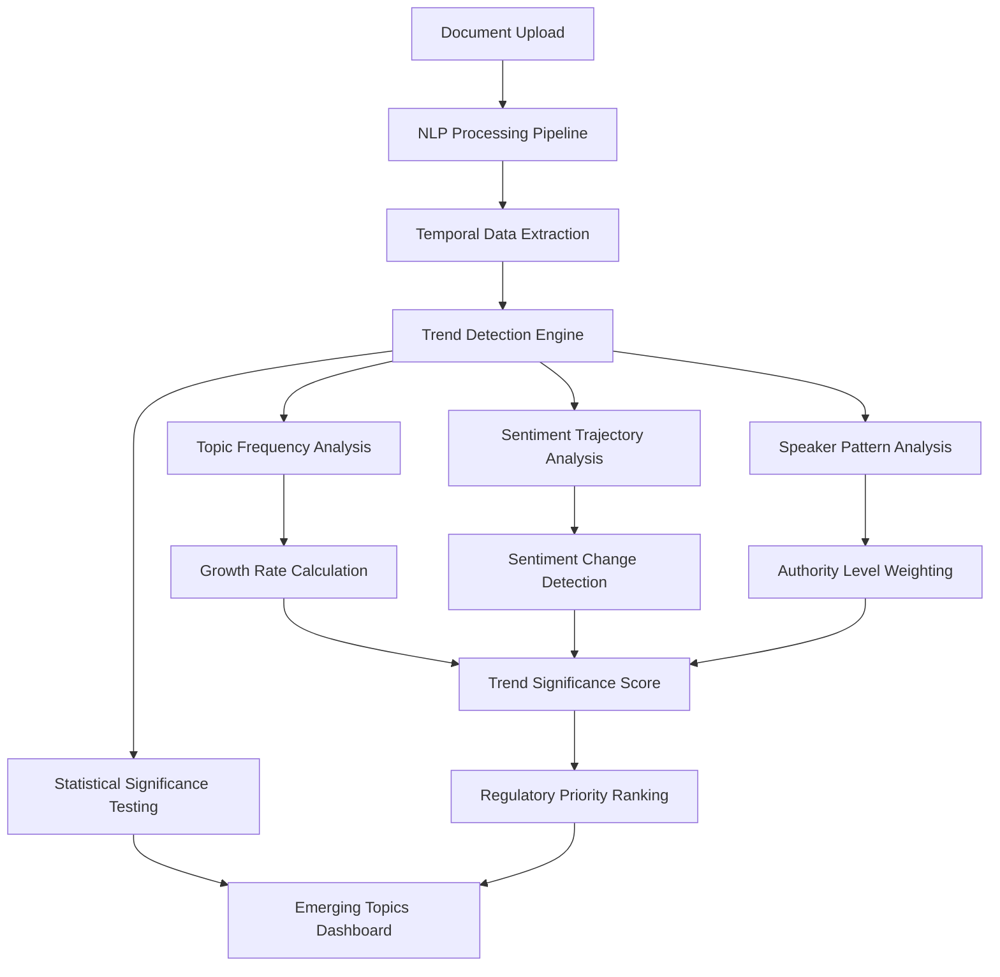
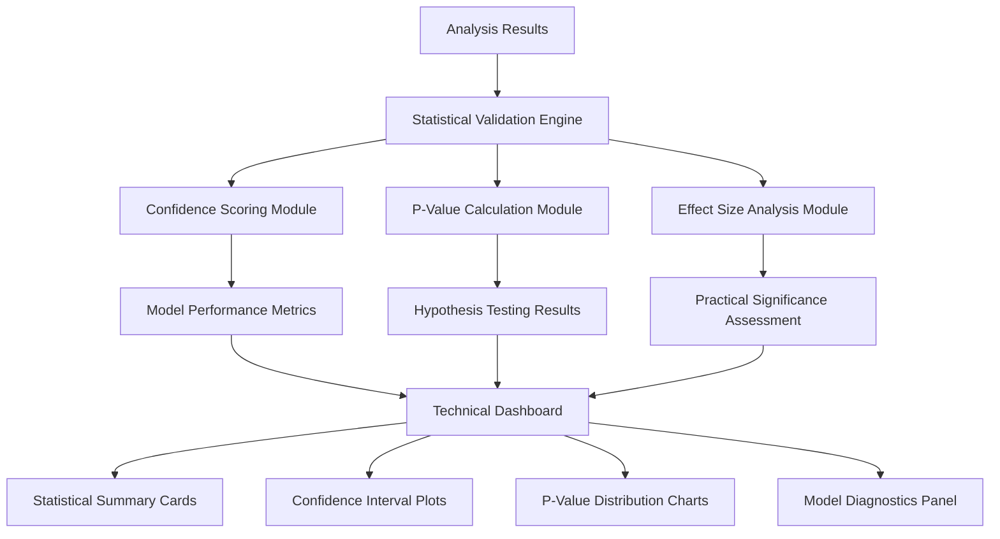

# 📋 **FEATURE ENHANCEMENT PLAN: BoE Supervisor Dashboard Extensions**

Based on analysis of the current dashboard structure, this document outlines two new feature modules that can be safely added without disrupting the working version.

---

## 🎯 **FEATURE 1: Advanced Emerging Topics & Trend Analysis**

### **Current State Analysis**
- ✅ Basic emerging topics analysis exists in `_generate_emerging_topics_analysis()`
- ✅ Static sample data with hardcoded growth rates and sentiment changes
- ❌ No real-time trend detection from actual data
- ❌ No statistical significance testing for trends

### **Enhancement Plan: Dynamic Trend Detection Engine**

#### **🔧 Technical Architecture**


#### **📊 Core Components**

**1. Dynamic Trend Detection Module**
```python
class EmergingTopicsEngine:
    def __init__(self):
        self.baseline_period = 4  # quarters
        self.recent_period = 2    # quarters
        self.significance_threshold = 0.05  # p-value
        
    def detect_emerging_topics(self, df: pd.DataFrame) -> Dict:
        """
        Real-time detection of emerging topics from actual data
        """
        # Quarter-based data segmentation
        # Topic frequency analysis with statistical testing
        # Sentiment trajectory analysis
        # Growth rate calculation with confidence intervals
        
    def calculate_trend_significance(self, topic_data: Dict) -> Dict:
        """
        Statistical significance testing for trend detection
        """
        # Mann-Whitney U test for frequency changes
        # T-test for sentiment changes
        # Chi-square test for speaker pattern changes
```

**2. Enhanced Metrics & Calculations**
- **Growth Rate with Confidence Intervals**: Statistical confidence bounds
- **Trend Momentum**: Acceleration/deceleration detection
- **Regulatory Urgency Score**: Weighted by speaker authority and topic criticality
- **Cross-Topic Correlation**: Identify related emerging themes

**3. Advanced Visualizations**
- **Interactive Trend Heatmaps**: Quarter-over-quarter topic evolution
- **Sentiment Trajectory Charts**: Multi-line time series with confidence bands
- **Topic Emergence Timeline**: Chronological appearance and growth patterns
- **Regulatory Priority Matrix**: Risk vs. Growth rate scatter plots

---

## 🔬 **FEATURE 2: Technical Data Science Dashboard**

### **Current State Analysis**
- ✅ Basic risk scoring in `RiskScorer`
- ✅ Statistical analysis components available
- ❌ No statistical validation dashboard for supervisors
- ❌ No confidence scoring or p-value reporting

### **Enhancement Plan: Statistical Validation Dashboard**

#### **🔧 Technical Architecture**


#### **📊 Core Components**

**1. Statistical Validation Engine**
```python
class StatisticalValidationEngine:
    def __init__(self):
        self.confidence_level = 0.95
        self.effect_size_thresholds = {
            'small': 0.2, 'medium': 0.5, 'large': 0.8
        }
        
    def validate_risk_scores(self, analysis_results: Dict) -> Dict:
        """
        Comprehensive statistical validation of risk analysis
        """
        # Bootstrap confidence intervals for risk scores
        # Cross-validation performance metrics
        # Statistical significance testing
        
    def calculate_model_diagnostics(self, data: pd.DataFrame) -> Dict:
        """
        Model performance and diagnostic metrics
        """
        # R-squared, RMSE, MAE for regression components
        # Precision, Recall, F1 for classification components
        # Residual analysis and normality tests
```

**2. Advanced Statistical Metrics**
- **Confidence Intervals**: Bootstrap and parametric confidence bounds
- **P-Values**: Multiple hypothesis testing with Bonferroni correction
- **Effect Sizes**: Cohen's d, eta-squared for practical significance
- **Model Performance**: Cross-validation scores, prediction intervals
- **Data Quality Metrics**: Missing data analysis, outlier detection

**3. Technical Visualizations**
- **Statistical Summary Dashboard**: Key metrics in professional cards
- **Confidence Interval Plots**: Error bars and uncertainty visualization
- **P-Value Heatmaps**: Multiple testing results matrix
- **Model Diagnostic Plots**: Residuals, Q-Q plots, prediction intervals
- **Data Quality Assessment**: Missing data patterns, outlier identification

---

## 🚀 **IMPLEMENTATION STRATEGY**

### **Phase 1: Safe Fork Creation**
1. **Create Feature Branches**
   - `feature/advanced-emerging-topics`
   - `feature/statistical-validation-dashboard`

2. **Modular Architecture**
   - New files: `boe_supervisor_dashboard_v2.py`
   - Enhanced modules: `scripts/emerging_topics/` and `scripts/statistical_validation/`
   - No modifications to existing working dashboard

### **Phase 2: Feature Development**

**Week 1: Advanced Emerging Topics**
- Dynamic trend detection engine
- Real-time topic frequency analysis
- Statistical significance testing for trends
- Enhanced visualizations

**Week 2: Statistical Validation Dashboard**
- Statistical validation engine
- Confidence scoring and p-value calculations
- Model diagnostics and performance metrics
- Technical visualization components

### **Phase 3: Integration & Testing**
- Comprehensive testing with sample data
- Performance optimization
- Documentation and user guides
- Deployment to separate ports (8508, 8509)

---

## 📋 **DETAILED FEATURE SPECIFICATIONS**

### **Feature 1: Advanced Emerging Topics**

#### **Key Enhancements**
1. **Real-Time Trend Detection**
   - Dynamic baseline calculation from historical data
   - Automated topic emergence identification
   - Growth rate calculation with statistical confidence

2. **Enhanced Metrics**
   - **Trend Momentum**: Rate of acceleration/deceleration
   - **Regulatory Urgency**: Weighted by speaker authority
   - **Cross-Topic Correlation**: Related theme identification
   - **Predictive Trajectory**: Forecasted trend continuation

3. **Advanced Visualizations**
   - Interactive trend heatmaps with drill-down capability
   - Multi-dimensional scatter plots (growth vs. sentiment vs. urgency)
   - Timeline visualization with emergence points
   - Comparative analysis charts (institution vs. peers)

#### **Statistical Rigor**
- **Mann-Whitney U Test**: For frequency change significance
- **T-Test**: For sentiment change significance
- **Chi-Square Test**: For speaker pattern changes
- **Bonferroni Correction**: Multiple testing adjustment

### **Feature 2: Statistical Validation Dashboard**

#### **Key Components**
1. **Model Performance Metrics**
   - Cross-validation scores with confidence intervals
   - Prediction accuracy and uncertainty quantification
   - Feature importance analysis with statistical significance

2. **Statistical Significance Testing**
   - P-value calculations for all risk components
   - Multiple hypothesis testing corrections
   - Effect size calculations (Cohen's d, eta-squared)

3. **Data Quality Assessment**
   - Missing data pattern analysis
   - Outlier detection and impact assessment
   - Data distribution normality testing

4. **Confidence Scoring**
   - Bootstrap confidence intervals for all metrics
   - Prediction intervals for risk scores
   - Uncertainty propagation through analysis pipeline

#### **Technical Visualizations**
- **Statistical Summary Cards**: Key metrics with confidence bounds
- **Model Diagnostic Plots**: Residuals, Q-Q plots, leverage plots
- **Uncertainty Visualization**: Error bars, confidence bands
- **Performance Tracking**: Model accuracy over time

---

## 🎯 **SUCCESS CRITERIA**

### **Feature 1: Advanced Emerging Topics**
- ✅ Real-time trend detection from uploaded documents
- ✅ Statistical significance testing for all identified trends
- ✅ Interactive visualizations with drill-down capability
- ✅ Regulatory priority ranking with confidence scores

### **Feature 2: Statistical Validation Dashboard**
- ✅ Comprehensive statistical validation of all analysis components
- ✅ P-value and confidence interval reporting
- ✅ Model performance metrics with uncertainty quantification
- ✅ Data quality assessment and diagnostic reporting

### **Integration Requirements**
- ✅ No disruption to existing working dashboard
- ✅ Modular architecture for easy maintenance
- ✅ Comprehensive documentation and user guides
- ✅ Performance optimization for real-time analysis

---

## 📁 **FILE STRUCTURE FOR NEW FEATURES**

```
data_science/
├── boe_supervisor_dashboard_v2.py              # Enhanced dashboard with new features
├── scripts/
│   ├── emerging_topics/
│   │   ├── __init__.py
│   │   ├── trend_detection_engine.py           # Dynamic trend detection
│   │   ├── statistical_significance.py        # Statistical testing for trends
│   │   └── advanced_visualizations.py         # Enhanced trend visualizations
│   └── statistical_validation/
│       ├── __init__.py
│       ├── validation_engine.py               # Statistical validation framework
│       ├── confidence_scoring.py              # Confidence interval calculations
│       ├── model_diagnostics.py               # Model performance metrics
│       └── technical_visualizations.py        # Statistical visualization components
├── config/
│   ├── emerging_topics_config.yaml            # Configuration for trend detection
│   └── statistical_validation_config.yaml     # Configuration for validation
└── docs/
    ├── EMERGING_TOPICS_GUIDE.md               # User guide for trend analysis
    └── STATISTICAL_VALIDATION_GUIDE.md        # User guide for technical dashboard
```

---

## 🔄 **NEXT STEPS**

1. **User Confirmation**: Confirm which feature to implement first
2. **Detailed Design**: Create detailed technical specifications
3. **Development**: Implement chosen feature with comprehensive testing
4. **Integration**: Safe integration with existing dashboard
5. **Documentation**: Create user guides and technical documentation

**Recommendation**: Start with **Feature 1 (Advanced Emerging Topics)** as it builds directly on existing functionality and provides immediate supervisory value.