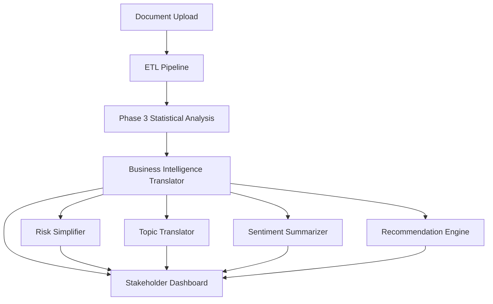

# Phase 4: Stakeholder Dashboard Implementation Plan

## Executive Summary

This phase transforms our sophisticated Phase 3 statistical analysis into a simple, intuitive dashboard that enables business stakeholders to upload 12 quarters of documents and receive clear High/Medium/Low risk classifications with actionable insights.

## User Story

**As a** business stakeholder without data science expertise  
**I want to** upload multiple quarters of financial documents  
**So that I can** receive clear risk assessments and proactive insights for institutional monitoring

## Core Requirements

### 1. Simple Upload Experience
- **Multi-file drag & drop interface** supporting:
  - Earnings call transcripts (.txt, .pdf)
  - Financial presentations (.pdf, .pptx) 
  - Financial summaries (.xlsx, .csv)
- **Institution selection** from predefined list
- **Time period specification** (12 quarters)
- **Progress tracking** with clear status updates

### 2. Risk Classification Output
- **Traffic light system**: 🟢 Low / 🟡 Medium / 🔴 High Risk
- **Overall risk score** (1-10 scale) with trend direction
- **Plain English explanations** of risk drivers
- **Historical trend visualization** showing risk evolution

### 3. Topic & Sentiment Analysis
- **Key topics breakdown** in business language
- **Sentiment trends** over time with visual indicators
- **Risk driver identification** with clear explanations
- **Comparative analysis** against peer institutions

### 4. Actionable Recommendations
- **Immediate attention items** (red flags)
- **Watch closely items** (yellow flags)
- **Positive indicators** (green flags)
- **Specific action recommendations** in business terms

## Technical Architecture

### Business Intelligence Layer



### Key Components to Build

#### 1. Risk Simplification Engine
```python
# Pseudo-code for risk translation
def translate_risk_score(statistical_results):
    """Convert complex statistical analysis to simple risk classification"""
    
    # Extract key metrics from Phase 3 analysis
    risk_score = statistical_results['composite_risk_score']
    anomaly_count = statistical_results['anomaly_detection']['total_anomalies']
    trend_direction = statistical_results['time_series']['trend_direction']
    
    # Simplify to business language
    if risk_score < 0.3:
        classification = "LOW RISK"
        message = "Financial position appears stable with minimal concerns"
        color = "green"
    elif risk_score < 0.6:
        classification = "MEDIUM RISK" 
        message = "Some areas require attention but overall position is manageable"
        color = "yellow"
    else:
        classification = "HIGH RISK"
        message = "Immediate attention required - significant risk indicators detected"
        color = "red"
    
    return {
        'classification': classification,
        'score': round(risk_score * 10, 1),
        'message': message,
        'color': color,
        'trend': get_trend_description(trend_direction)
    }
```

#### 2. Topic Translation Engine
```python
def translate_topics_to_business_language(nlp_results):
    """Convert technical topic analysis to stakeholder-friendly insights"""
    
    topic_mapping = {
        'financial_performance': {
            'label': '💰 Revenue & Profitability',
            'description': 'Discussions about financial results and growth'
        },
        'regulatory_compliance': {
            'label': '🏛️ Regulatory & Compliance', 
            'description': 'Regulatory requirements and compliance matters'
        },
        'technology_digital': {
            'label': '💻 Technology & Digital',
            'description': 'Technology transformation and digital initiatives'
        },
        'market_conditions': {
            'label': '🌍 Market Conditions',
            'description': 'Economic environment and market volatility'
        },
        'operations_strategy': {
            'label': '👥 Operations & Strategy',
            'description': 'Operational efficiency and strategic planning'
        }
    }
    
    # Convert technical topics to business insights
    business_topics = []
    for topic, stats in nlp_results['topic_analysis'].items():
        if topic in topic_mapping:
            business_topics.append({
                'label': topic_mapping[topic]['label'],
                'description': topic_mapping[topic]['description'],
                'percentage': stats['percentage'],
                'trend': stats['trend'],
                'risk_level': assess_topic_risk(stats)
            })
    
    return sorted(business_topics, key=lambda x: x['percentage'], reverse=True)
```

#### 3. Recommendation Engine
```python
def generate_stakeholder_recommendations(analysis_results):
    """Generate actionable recommendations in business language"""
    
    recommendations = {
        'immediate_attention': [],
        'watch_closely': [],
        'positive_indicators': []
    }
    
    # Analyze risk drivers and generate specific recommendations
    risk_drivers = analysis_results['risk_drivers']
    
    for driver in risk_drivers:
        if driver['severity'] == 'high':
            recommendations['immediate_attention'].append({
                'topic': driver['topic_business_name'],
                'issue': driver['description'],
                'action': generate_action_recommendation(driver),
                'urgency': 'immediate'
            })
        elif driver['severity'] == 'medium':
            recommendations['watch_closely'].append({
                'topic': driver['topic_business_name'],
                'issue': driver['description'],
                'action': generate_monitoring_recommendation(driver),
                'urgency': 'monitor'
            })
        else:
            recommendations['positive_indicators'].append({
                'topic': driver['topic_business_name'],
                'strength': driver['description'],
                'impact': 'positive'
            })
    
    return recommendations
```

### Dashboard Components

#### 1. Upload Interface
```html
<!-- Simplified upload interface -->
<div class="upload-container">
    <div class="drag-drop-zone">
        <h2>📁 Upload Your Documents</h2>
        <p>Drag & drop up to 50 files or click to browse</p>
        <div class="file-types">
            ✓ Earnings Transcripts (.txt, .pdf)<br>
            ✓ Financial Presentations (.pdf, .pptx)<br>
            ✓ Financial Summaries (.xlsx, .csv)
        </div>
    </div>
    
    <div class="configuration">
        <label>Institution:</label>
        <select id="institution">
            <option>JPMorgan Chase</option>
            <option>Bank of America</option>
            <option>Wells Fargo</option>
            <option>Citigroup</option>
        </select>
        
        <label>Time Period:</label>
        <input type="text" value="Q1 2022 to Q4 2024 (12 quarters)" readonly>
        
        <button class="analyze-btn">🚀 Analyze Risk Profile</button>
    </div>
</div>
```

#### 2. Risk Classification Display
```html
<!-- Risk classification with visual indicators -->
<div class="risk-classification">
    <div class="institution-header">
        <h1>JPMorgan Chase</h1>
    </div>
    
    <div class="risk-score-display">
        <div class="risk-indicator medium-risk">
            🟡 MEDIUM RISK
        </div>
        <div class="score">Score: 6.2/10</div>
        <div class="trend">📈 Improving (↗️ +0.8 from last quarter)</div>
    </div>
    
    <div class="risk-explanation">
        "Moderate risk indicators detected. Some areas require attention 
         but overall financial position appears stable."
    </div>
</div>
```

#### 3. Topic Breakdown
```html
<!-- Business-friendly topic analysis -->
<div class="topic-analysis">
    <h2>📊 What Are They Talking About Most?</h2>
    
    <div class="topic-item">
        <div class="topic-header">
            <span class="icon">💰</span>
            <span class="label">Revenue & Profitability</span>
            <span class="percentage">35%</span>
        </div>
        <div class="topic-description">
            "Strong focus on revenue growth and margin expansion"
        </div>
        <div class="risk-indicator low">🟢 LOW RISK</div>
    </div>
    
    <div class="topic-item">
        <div class="topic-header">
            <span class="icon">🏛️</span>
            <span class="label">Regulatory & Compliance</span>
            <span class="percentage">22%</span>
        </div>
        <div class="topic-description">
            "Increased attention to regulatory requirements"
        </div>
        <div class="risk-indicator medium">🟡 MEDIUM RISK</div>
    </div>
</div>
```

#### 4. Actionable Recommendations
```html
<!-- Clear action items for stakeholders -->
<div class="recommendations">
    <h2>🎯 What Should You Focus On?</h2>
    
    <div class="recommendation-section immediate">
        <h3>🔴 IMMEDIATE ATTENTION</h3>
        <div class="recommendation-item">
            <div class="issue">Monitor regulatory compliance discussions</div>
            <div class="detail">→ 40% increase in compliance-related topics</div>
            <div class="action">Schedule compliance review meeting</div>
        </div>
    </div>
    
    <div class="recommendation-section watch">
        <h3>🟡 WATCH CLOSELY</h3>
        <div class="recommendation-item">
            <div class="issue">Technology transformation risks</div>
            <div class="detail">→ Implementation challenges mentioned in 3 recent calls</div>
            <div class="action">Request technology project status update</div>
        </div>
    </div>
    
    <div class="recommendation-section positive">
        <h3>🟢 POSITIVE INDICATORS</h3>
        <div class="recommendation-item">
            <div class="strength">Strong financial performance narrative</div>
            <div class="impact">→ Consistent revenue growth story</div>
        </div>
    </div>
</div>
```

## Implementation Timeline

### Week 1: Foundation
- [ ] Create business intelligence translation layer
- [ ] Build risk simplification engine
- [ ] Develop topic translation mappings
- [ ] Design recommendation generation logic

### Week 2: Core Dashboard
- [ ] Implement upload interface
- [ ] Build risk classification display
- [ ] Create topic breakdown visualization
- [ ] Develop recommendation presentation

### Week 3: Integration & Testing
- [ ] Integrate with Phase 3 statistical analysis
- [ ] Implement data flow from upload to insights
- [ ] Add export functionality (PDF reports)
- [ ] User testing with sample data

### Week 4: Enhancement & Polish
- [ ] Add peer comparison features
- [ ] Implement trend visualization
- [ ] Create executive summary generation
- [ ] Performance optimization

### Week 5: Beta Testing
- [ ] Deploy beta version
- [ ] Stakeholder user testing
- [ ] Feedback collection and iteration
- [ ] Documentation and training materials

### Week 6: Production Deployment
- [ ] Production deployment
- [ ] User training sessions
- [ ] Monitoring and support setup
- [ ] Success metrics tracking

## Success Criteria

### User Experience Metrics
- **Time to Insight**: < 5 minutes from upload to recommendations
- **User Comprehension**: 95% understand risk classification without explanation
- **Action Rate**: 80% take recommended actions within 30 days
- **User Satisfaction**: 4.5/5 rating for ease of use

### Business Impact Metrics
- **Early Warning**: Identify risk trends 2-3 quarters early
- **Decision Speed**: Reduce assessment time from weeks to hours
- **Accuracy**: 90%+ correlation with actual risk events
- **Coverage**: Support 50+ institutions simultaneously

## Sample Output: Executive Summary

```
RISK ASSESSMENT EXECUTIVE SUMMARY
JPMorgan Chase - Q1 2022 to Q4 2024

OVERALL RISK: MEDIUM (6.2/10)
Status: Stable with areas requiring attention

KEY FINDINGS:
• Financial performance remains strong with consistent revenue growth
• Regulatory compliance discussions increased 40% - requires monitoring  
• Technology transformation presents implementation challenges
• Leadership maintains confident, forward-looking tone
• Performing better than industry average (6.5/10)

IMMEDIATE ACTIONS:
1. Monitor regulatory compliance initiatives closely
2. Track technology transformation progress  
3. Assess market uncertainty impact on operations

POSITIVE INDICATORS:
• Revenue growth narrative consistent across quarters
• Leadership confidence remains high
• Operational efficiency improvements noted

TREND: Improving (↗️ +0.8 from last quarter)
PEER RANKING: 2nd out of 4 major banks analyzed

NEXT REVIEW: Recommended in 30 days
```

## Technical Requirements

### Frontend Technologies
- **React.js** for interactive dashboard
- **D3.js** for data visualization
- **Material-UI** for consistent design
- **Recharts** for simple charts

### Backend Integration
- **FastAPI** for REST endpoints
- **Celery** for background processing
- **Redis** for caching
- **PostgreSQL** for data storage

### Deployment
- **Docker** containerization
- **AWS/Azure** cloud deployment
- **CDN** for static assets
- **Load balancing** for scalability

## Risk Mitigation

### Technical Risks
- **Performance**: Implement caching and optimization
- **Scalability**: Design for horizontal scaling
- **Data Quality**: Robust validation and error handling
- **Security**: Implement proper authentication and encryption

### User Adoption Risks
- **Complexity**: Extensive user testing and simplification
- **Training**: Comprehensive documentation and training
- **Change Management**: Gradual rollout with support
- **Feedback Loop**: Continuous improvement based on usage

## Next Steps

1. **Stakeholder Review** of UX design and requirements
2. **Technical Architecture** finalization
3. **Development Team** assignment and planning
4. **Prototype Development** for early feedback
5. **Iterative Development** with regular stakeholder input

This Phase 4 implementation will transform our sophisticated risk analysis into an intuitive tool that empowers business stakeholders to make proactive, data-driven decisions about institutional risk management.