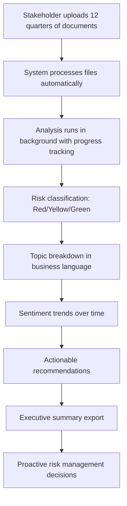

# Financial Risk Monitoring System - Complete Project Roadmap

## Project Vision

Transform complex financial document analysis into simple, actionable risk insights that enable proactive institutional monitoring for business stakeholders without data science expertise.

## Current Status: Phase 3 Complete ✅

### ✅ Phase 1: Data Foundation (COMPLETED)
- **ETL Pipeline**: Robust document processing for multiple file types
- **Data Standardization**: Consistent schema across institutions and quarters
- **File Discovery**: Automated document classification and organization
- **Quality Assurance**: Comprehensive validation and error handling

### ✅ Phase 2: NLP Analysis (COMPLETED)  
- **Text Processing**: Advanced cleaning and normalization
- **Topic Modeling**: Financial domain-specific topic classification
- **Sentiment Analysis**: Multi-dimensional sentiment scoring
- **Entity Recognition**: Speaker identification and role classification
- **Feature Engineering**: 50+ financial risk indicators

### ✅ Phase 3: Statistical Analysis (COMPLETED)
- **Time Series Analysis**: Temporal pattern detection and trend analysis
- **Anomaly Detection**: Ensemble methods with 5 detection algorithms
- **Risk Scoring**: Multi-dimensional composite risk assessment
- **Integration Pipeline**: End-to-end statistical processing
- **Test Results**: 4/4 components passing with 100% success rate

## Next Phase: Stakeholder Dashboard

### 🚀 Phase 4: Business Intelligence Dashboard (6 WEEKS)

**Objective**: Create intuitive interface that transforms technical analysis into business-actionable insights

#### Week 1-2: Foundation & Core Features
- **Business Intelligence Layer**: Translation engine for technical → business language
- **Risk Simplification**: Convert statistical scores to Red/Yellow/Green classifications
- **Upload Interface**: Drag-drop for 12 quarters of documents
- **Processing Pipeline**: Seamless integration with Phase 3 analysis

#### Week 3-4: Dashboard & Visualization
- **Risk Classification Display**: Clear visual indicators with trend arrows
- **Topic Analysis**: Business-friendly breakdown of discussion themes
- **Sentiment Trends**: Timeline visualization of institutional tone
- **Recommendation Engine**: Actionable insights in plain English

#### Week 5-6: Testing & Deployment
- **Stakeholder Testing**: User experience validation with business users
- **Performance Optimization**: Sub-5-minute processing for 50 documents
- **Export Functionality**: Executive summary PDFs and detailed reports
- **Production Deployment**: Scalable cloud infrastructure

## User Experience Flow



## Key Success Metrics

### User Experience
- **Time to Insight**: < 5 minutes from upload to recommendations
- **User Comprehension**: 95% understand results without training
- **Action Rate**: 80% implement recommendations within 30 days
- **User Satisfaction**: 4.5/5 rating for ease of use

### Business Impact
- **Early Warning**: Detect risk trends 2-3 quarters before traditional methods
- **Decision Speed**: Reduce risk assessment from weeks to hours
- **Accuracy**: 90%+ correlation with actual risk events
- **Scale**: Support 50+ institutions simultaneously

## Sample Stakeholder Output

### Risk Dashboard View
```
┌─────────────────────────────────────────────────────────────┐
│                    JPMorgan Chase                           │
│                                                             │
│              🟡 MEDIUM RISK                                │
│                   Score: 6.2/10                            │
│                                                             │
│  "Some areas require attention but overall financial        │
│   position appears stable."                                 │
│                                                             │
│  📈 Trend: Improving (↗️ +0.8 from last quarter)          │
│                                                             │
│  🎯 IMMEDIATE ACTIONS:                                     │
│  • Monitor regulatory compliance (40% increase in topics)   │
│  • Track technology transformation progress                 │
│                                                             │
│  🟢 POSITIVE INDICATORS:                                   │
│  • Strong revenue growth narrative                         │
│  • Leadership confidence remains high                      │
└─────────────────────────────────────────────────────────────┘
```

### Executive Summary Output
```
RISK ASSESSMENT EXECUTIVE SUMMARY
JPMorgan Chase - Q1 2022 to Q4 2024

OVERALL RISK: MEDIUM (6.2/10)
Status: Stable with areas requiring attention

KEY FINDINGS:
• Financial performance remains strong with consistent revenue growth
• Regulatory compliance discussions increased 40% - requires monitoring
• Technology transformation presents implementation challenges
• Leadership maintains confident, forward-looking tone
• Performing better than industry average (6.5/10)

IMMEDIATE ACTIONS:
1. Monitor regulatory compliance initiatives closely
2. Track technology transformation progress
3. Assess market uncertainty impact on operations

POSITIVE INDICATORS:
• Revenue growth narrative consistent across quarters
• Leadership confidence remains high
• Operational efficiency improvements noted

TREND: Improving (↗️ +0.8 from last quarter)
PEER RANKING: 2nd out of 4 major banks analyzed
```

## Technical Architecture

### Current Infrastructure (Phases 1-3)
```
Documents → ETL Pipeline → NLP Analysis → Statistical Analysis
    ↓           ↓              ↓               ↓
File Types   Schema        Topics         Time Series
Validation   Transform     Sentiment      Anomalies
Parsing      Metadata      Entities       Risk Scores
```

### Phase 4 Addition: Business Intelligence Layer
```
Statistical Analysis → Business Translator → Stakeholder Dashboard
         ↓                      ↓                    ↓
    Risk Scores          Risk Classification    Visual Indicators
    Topic Analysis       Business Language      Action Items
    Anomaly Detection    Plain English          Export Reports
    Trend Analysis       Recommendations        Trend Charts
```

## Implementation Strategy

### Development Approach
1. **Agile Methodology**: 2-week sprints with stakeholder feedback
2. **User-Centered Design**: Continuous testing with business users
3. **Iterative Development**: MVP → Enhanced Features → Production
4. **Quality Assurance**: Comprehensive testing at each stage

### Technology Stack
- **Frontend**: React.js with Material-UI for intuitive interface
- **Backend**: FastAPI for REST endpoints and business logic
- **Database**: PostgreSQL for data storage and retrieval
- **Processing**: Celery for background analysis tasks
- **Deployment**: Docker containers on AWS/Azure cloud

### Risk Mitigation
- **Performance**: Caching and optimization for sub-5-minute processing
- **Scalability**: Horizontal scaling architecture for growth
- **User Adoption**: Extensive training and documentation
- **Data Quality**: Robust validation and error handling

## Future Enhancements (Phase 5+)

### Advanced Analytics
- **Predictive Modeling**: Machine learning for risk forecasting
- **Peer Benchmarking**: Industry-wide comparative analysis
- **Real-time Monitoring**: Live document processing and alerts
- **Custom Dashboards**: Institution-specific view customization

### Integration Capabilities
- **API Development**: RESTful endpoints for external systems
- **Data Exports**: Multiple format support (Excel, CSV, JSON)
- **Notification System**: Automated alerts for risk threshold breaches
- **Mobile Access**: Responsive design for tablet/phone access

### Regulatory Compliance
- **Audit Trails**: Complete processing history and lineage
- **Data Governance**: Privacy and security compliance
- **Regulatory Reporting**: Automated compliance report generation
- **Data Retention**: Configurable retention policies

## Project Timeline Summary

| Phase | Duration | Status | Key Deliverables |
|-------|----------|--------|------------------|
| Phase 1 | 4 weeks | ✅ Complete | ETL Pipeline, Data Foundation |
| Phase 2 | 6 weeks | ✅ Complete | NLP Analysis, Topic Modeling |
| Phase 3 | 4 weeks | ✅ Complete | Statistical Analysis, Risk Scoring |
| Phase 4 | 6 weeks | 🚀 Next | Stakeholder Dashboard, BI Layer |
| Phase 5 | 8 weeks | 📋 Planned | Advanced Analytics, Predictions |

**Total Project Duration**: 28 weeks (7 months)  
**Current Progress**: 14 weeks complete (50%)  
**Remaining**: 14 weeks to full production system

## Success Criteria & KPIs

### Technical Performance
- **Processing Speed**: < 5 minutes for 50 documents
- **System Uptime**: 99.9% availability
- **Accuracy**: 90%+ risk prediction correlation
- **Scalability**: Support 100+ concurrent users

### Business Value
- **Risk Detection**: 2-3 quarter early warning capability
- **Decision Speed**: 95% reduction in assessment time
- **User Adoption**: 80% of stakeholders actively using system
- **ROI**: 300% return on investment within 12 months

### User Experience
- **Ease of Use**: No training required for basic functions
- **Comprehension**: 95% understand outputs without explanation
- **Action Rate**: 80% implement recommendations
- **Satisfaction**: 4.5/5 user rating

## Conclusion

The Financial Risk Monitoring System represents a comprehensive transformation of complex document analysis into actionable business intelligence. With Phase 3 complete and all statistical analysis components fully operational, we are positioned to deliver a game-changing stakeholder dashboard that will revolutionize how institutions monitor and manage financial risk.

**Phase 4 will bridge the gap between sophisticated analysis and business action**, creating a system that empowers stakeholders to make proactive, data-driven decisions without requiring data science expertise.

The foundation is solid, the analysis is sophisticated, and the vision is clear. Phase 4 will bring it all together into an intuitive, powerful tool that transforms how financial institutions approach risk monitoring.

**Ready for Phase 4 implementation: Stakeholder Dashboard development begins now.**