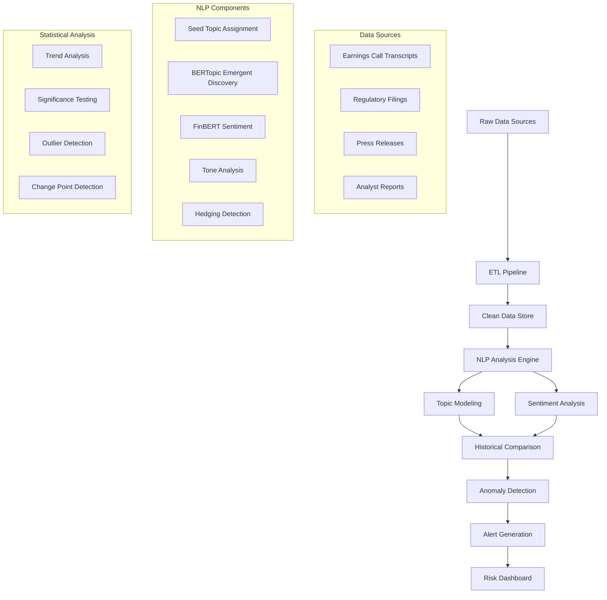

# Risk Monitoring Pipeline: Topic Modeling & Sentiment Analysis Architecture Plan

## Executive Summary

This document outlines the architecture for an end-to-end risk monitoring pipeline that analyzes earnings calls and financial communications from US and European banks to detect early risk signals. The system combines seed-based topic modeling with emergent topic discovery, advanced sentiment analysis, and statistical significance testing to minimize noise and maximize signal detection.

## 1. System Architecture Overview



## 2. Data Architecture

### 2.1 Input Data Structure
```
data/
├── raw/
│   ├── us_banks/
│   │   ├── jpmorgan_chase/Q1_2025/
│   │   ├── bank_of_america/Q1_2025/
│   │   ├── wells_fargo/Q1_2025/
│   │   └── citigroup/Q1_2025/
│   └── european_banks/
│       ├── hsbc/Q1_2025/
│       ├── barclays/Q1_2025/
│       ├── deutsche_bank/Q1_2025/
│       └── ubs/Q1_2025/
├── processed/
│   ├── sentences/
│   ├── topics/
│   ├── sentiment/
│   └── aggregated/
└── models/
    ├── topic_models/
    ├── sentiment_models/
    └── anomaly_detectors/
```

### 2.2 Data Schema
```python
# Sentence-level schema
sentence_schema = {
    'sentence_id': 'string',
    'bank_name': 'string',
    'quarter': 'string',
    'call_id': 'string',
    'speaker': 'string',
    'speaker_role': 'string',  # CEO, CFO, CRO, Analyst, etc.
    'timestamp': 'datetime',
    'text': 'string',
    'text_length': 'int',
    'topic_seed': 'string',     # Seed-assigned topic
    'topic_emergent': 'string', # BERTopic-discovered topic
    'topic_confidence': 'float',
    'sentiment_label': 'string', # positive, negative, neutral
    'sentiment_score': 'float',
    'hedging_score': 'float',
    'uncertainty_score': 'float',
    'formality_score': 'float',
    'financial_terms_count': 'int',
    'risk_keywords_count': 'int'
}
```

## 3. Topic Modeling Strategy

### 3.1 Hybrid Approach: Seed + Emergent Topics

#### 3.1.1 Seed Topic Categories
```yaml
seed_topics:
  credit_risk:
    keywords: [loan, credit, default, provision, npl, charge-off, delinquency]
    weight: 1.0
  
  operational_risk:
    keywords: [cyber, fraud, compliance, regulatory, operational, control]
    weight: 1.0
  
  market_risk:
    keywords: [trading, market, volatility, var, stress, liquidity]
    weight: 1.0
  
  regulatory_risk:
    keywords: [regulation, capital, basel, stress test, ccar, cecl]
    weight: 1.0
  
  macroeconomic_risk:
    keywords: [inflation, recession, gdp, unemployment, interest rate]
    weight: 1.0
  
  climate_risk:
    keywords: [climate, esg, sustainability, carbon, environmental]
    weight: 0.8
  
  digital_transformation:
    keywords: [digital, technology, fintech, blockchain, ai, automation]
    weight: 0.8
  
  geopolitical_risk:
    keywords: [geopolitical, sanctions, trade war, brexit, china]
    weight: 0.7
```

#### 3.1.2 Emergent Topic Discovery
- **Algorithm**: BERTopic with financial domain embeddings
- **Preprocessing**: Financial text normalization, entity recognition
- **Clustering**: HDBSCAN with minimum cluster size = 50 sentences
- **Representation**: c-TF-IDF with financial vocabulary boost
- **Coherence Threshold**: Minimum c_v score of 0.4

### 3.2 Statistical Significance Framework

#### 3.2.1 Topic Prevalence Testing
```python
def test_topic_significance(topic_counts, baseline_period, current_period):
    """
    Chi-square test for topic prevalence changes
    H0: Topic prevalence is unchanged
    H1: Topic prevalence has significantly changed
    """
    # Chi-square test with Bonferroni correction
    # Minimum effect size: Cohen's w = 0.3 (medium effect)
    # Alpha level: 0.01 (after correction)
```

#### 3.2.2 Noise Reduction Strategies
- **Minimum Topic Size**: 50+ sentences per quarter
- **Temporal Consistency**: Topic must appear in 3+ consecutive quarters
- **Cross-Bank Validation**: Signal must appear in 2+ banks
- **Statistical Power**: Minimum 80% power for effect detection

## 4. Sentiment Analysis Framework

### 4.1 Multi-Layered Sentiment Analysis

#### 4.1.1 Primary Sentiment (FinBERT)
- **Model**: ProsusAI/finbert fine-tuned on financial texts
- **Output**: {positive, negative, neutral} with confidence scores
- **Calibration**: Temperature scaling for probability calibration

#### 4.1.2 Tone Analysis Components
```python
tone_features = {
    'hedging_score': count_hedging_words(text) / len(tokens),
    'uncertainty_score': uncertainty_lexicon_score(text),
    'formality_score': formal_language_ratio(text),
    'complexity_score': flesch_kincaid_score(text),
    'urgency_score': urgency_keywords_density(text),
    'confidence_score': confidence_markers_ratio(text)
}
```

#### 4.1.3 Risk-Specific Sentiment
- **Risk Escalation Language**: "deteriorating", "challenging", "pressure"
- **Risk Mitigation Language**: "improving", "strengthening", "robust"
- **Uncertainty Markers**: "may", "could", "potential", "uncertain"

### 4.2 Sentiment Aggregation Strategy

#### 4.2.1 Speaker-Weighted Sentiment
```python
speaker_weights = {
    'CEO': 1.0,
    'CFO': 0.9,
    'CRO': 1.0,  # Chief Risk Officer
    'CCO': 0.8,  # Chief Credit Officer
    'Analyst': 0.3,
    'Other': 0.2
}
```

#### 4.2.2 Topic-Specific Sentiment Trends
- Track sentiment evolution for each topic over time
- Detect sentiment regime changes using change point detection
- Calculate sentiment momentum (first derivative) and acceleration (second derivative)

## 5. Anomaly Detection & Early Warning System

### 5.1 Multi-Dimensional Anomaly Detection

#### 5.1.1 Statistical Methods
```python
anomaly_detectors = {
    'topic_prevalence': {
        'method': 'isolation_forest',
        'contamination': 0.05,
        'features': ['topic_count', 'topic_ratio', 'quarter_over_quarter_change']
    },
    'sentiment_shifts': {
        'method': 'change_point_detection',
        'algorithm': 'pelt',
        'penalty': 'bic',
        'min_size': 3  # quarters
    },
    'cross_bank_correlation': {
        'method': 'correlation_clustering',
        'threshold': 0.7,
        'min_banks': 3
    }
}
```

#### 5.1.2 Risk Signal Scoring
```python
def calculate_risk_score(topic, bank, quarter):
    """
    Composite risk score combining multiple signals
    """
    score_components = {
        'prevalence_anomaly': prevalence_z_score * 0.3,
        'sentiment_deterioration': sentiment_change * 0.25,
        'cross_bank_correlation': correlation_strength * 0.2,
        'temporal_persistence': persistence_score * 0.15,
        'topic_coherence': coherence_score * 0.1
    }
    
    # Weighted sum with confidence intervals
    risk_score = sum(score_components.values())
    confidence = calculate_confidence_interval(score_components)
    
    return risk_score, confidence
```

### 5.2 Alert Generation Framework

#### 5.2.1 Alert Severity Levels
```python
alert_thresholds = {
    'CRITICAL': {
        'risk_score': 0.8,
        'confidence': 0.9,
        'cross_bank_count': 3,
        'description': 'Immediate attention required'
    },
    'HIGH': {
        'risk_score': 0.6,
        'confidence': 0.8,
        'cross_bank_count': 2,
        'description': 'Monitor closely'
    },
    'MEDIUM': {
        'risk_score': 0.4,
        'confidence': 0.7,
        'cross_bank_count': 1,
        'description': 'Emerging signal'
    }
}
```

#### 5.2.2 Alert Enrichment
- **SHAP Explanations**: Feature importance for risk score
- **Historical Context**: Similar patterns in past quarters
- **Peer Comparison**: How signal compares across banks
- **Regulatory Context**: Relevant regulatory developments

## 6. Implementation Roadmap

### Phase 1: Foundation (Weeks 1-4)
- [ ] Set up data ingestion pipeline
- [ ] Implement basic topic modeling (seed-based)
- [ ] Deploy FinBERT sentiment analysis
- [ ] Create data validation framework

### Phase 2: Advanced Analytics (Weeks 5-8)
- [ ] Implement BERTopic for emergent discovery
- [ ] Add tone analysis components
- [ ] Build statistical significance testing
- [ ] Create anomaly detection algorithms

### Phase 3: Risk Intelligence (Weeks 9-12)
- [ ] Implement cross-bank correlation analysis
- [ ] Build alert generation system
- [ ] Create risk scoring framework
- [ ] Add SHAP explanations

### Phase 4: Production & Monitoring (Weeks 13-16)
- [ ] Deploy production pipeline
- [ ] Build monitoring dashboard
- [ ] Implement automated reporting
- [ ] Add model performance tracking

## 7. Technical Requirements

### 7.1 Core Dependencies
```python
# NLP & ML
transformers>=4.21.0
bertopic>=0.15.0
sentence-transformers>=2.2.0
scikit-learn>=1.1.0
umap-learn>=0.5.0
hdbscan>=0.8.0

# Financial NLP
finbert>=0.1.0  # or ProsusAI/finbert
spacy>=3.4.0

# Statistical Analysis
scipy>=1.9.0
statsmodels>=0.13.0
ruptures>=1.1.0  # change point detection
pyod>=1.0.0     # outlier detection

# Explainability
shap>=0.41.0
lime>=0.2.0

# Data Processing
pandas>=1.5.0
numpy>=1.21.0
pyarrow>=9.0.0
```

### 7.2 Infrastructure Requirements
- **Compute**: 32GB RAM, 8 CPU cores, GPU for transformer models
- **Storage**: 1TB for historical data, models, and outputs
- **Database**: PostgreSQL for metadata, ClickHouse for time series
- **Monitoring**: MLflow for model tracking, Grafana for dashboards

## 8. Validation & Testing Strategy

### 8.1 Model Validation
- **Topic Coherence**: c_v score > 0.4 for emergent topics
- **Sentiment Accuracy**: F1 > 0.85 on financial sentiment test set
- **Anomaly Detection**: Precision > 0.7, Recall > 0.6 on historical alerts

### 8.2 Business Validation
- **Expert Review**: Risk analysts validate topic assignments
- **Historical Backtesting**: Test on 2008, 2020 crisis periods
- **False Positive Analysis**: Track and minimize alert fatigue

## 9. Success Metrics

### 9.1 Technical Metrics
- **Topic Model Quality**: Average coherence score > 0.5
- **Sentiment Accuracy**: Correlation with expert ratings > 0.8
- **Alert Precision**: True positive rate > 70%
- **Processing Speed**: < 1 hour for quarterly analysis

### 9.2 Business Metrics
- **Early Detection**: Identify risks 1-2 quarters before market recognition
- **Coverage**: Monitor 95% of relevant risk themes
- **Actionability**: 80% of high-severity alerts lead to investigation
- **Noise Reduction**: < 20% false positive rate for critical alerts

## 10. Risk Mitigation

### 10.1 Technical Risks
- **Model Drift**: Quarterly model retraining and validation
- **Data Quality**: Automated data quality checks and alerts
- **Scalability**: Horizontal scaling with distributed computing

### 10.2 Business Risks
- **Regulatory Compliance**: Ensure model explainability and auditability
- **Bias Detection**: Regular bias testing across banks and regions
- **Human Oversight**: Expert review for all critical alerts

---

*This architecture plan provides the foundation for building a robust, statistically significant risk monitoring system that can detect early warning signals while minimizing noise and false positives.*