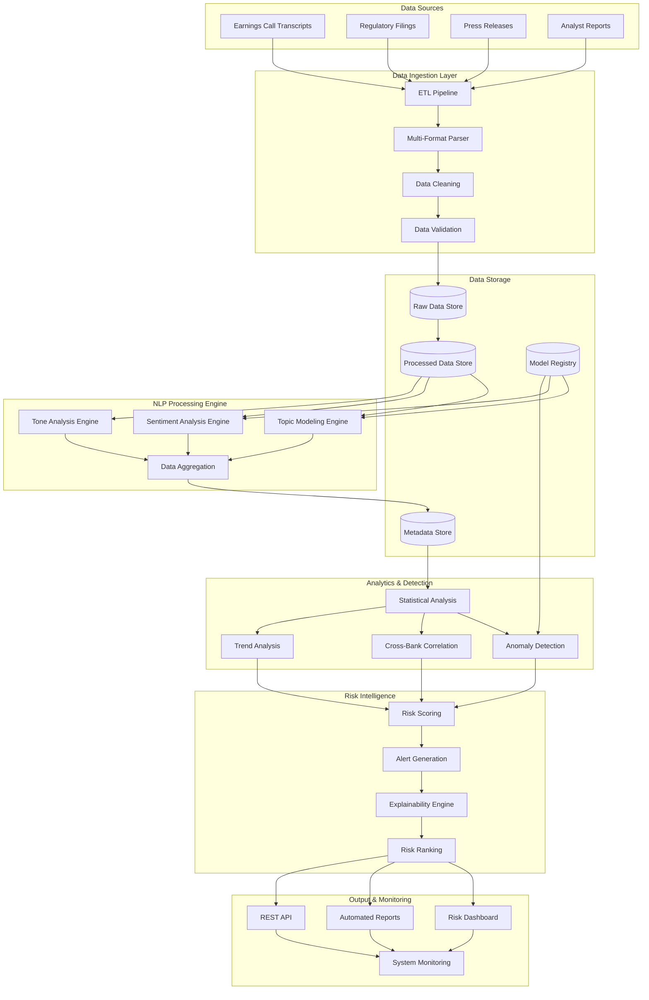
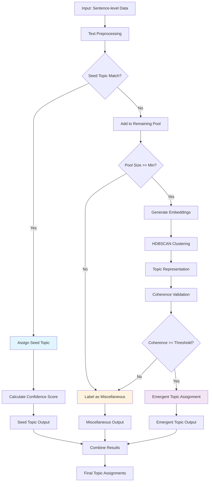
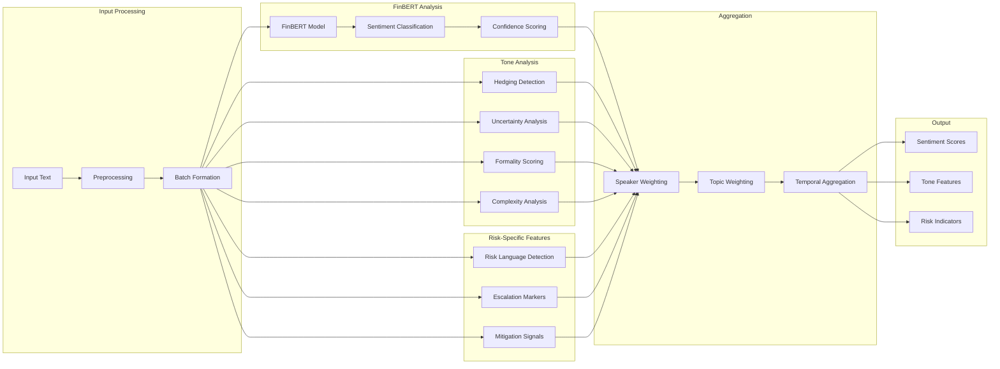
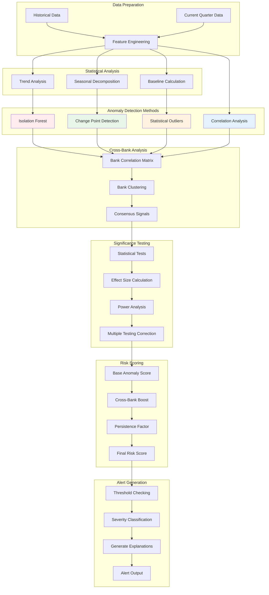
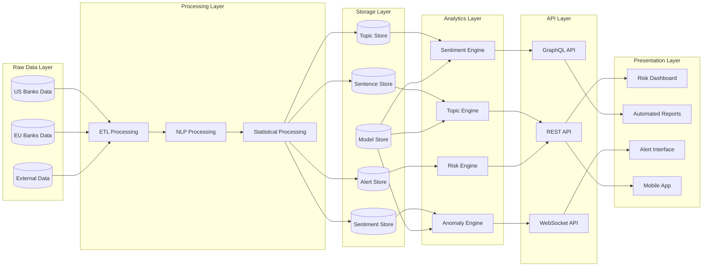
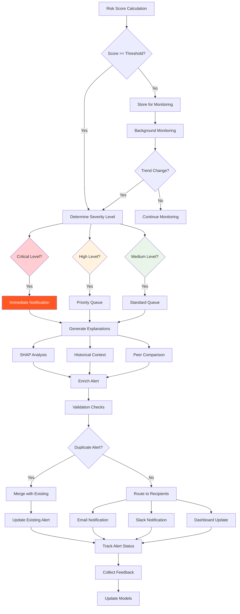

# Risk Monitoring System Architecture Diagrams

## 1. High-Level System Architecture

## 2. Topic Modeling Workflow

## 3. Sentiment Analysis Pipeline

## 4. Anomaly Detection Framework

## 5. Data Flow Architecture

## 6. Alert Generation Workflow

## 7. Model Training and Deployment Pipeline

```mermaid
graph LR
    subgraph "Data Preparation"
        RAW_DATA[Raw Training Data]
        CLEAN_DATA[Data Cleaning]
        FEATURE_ENG[Feature Engineering]
        SPLIT[Train/Val/Test Split]
    end
    
    subgraph "Model Development"
        TOPIC_TRAIN[Topic Model Training]
        SENT_TRAIN[Sentiment Model Training]
        ANOM_TRAIN[Anomaly Model Training]
        HYPEROPT[Hyperparameter Optimization]
    end
    
    subgraph "Model Validation"
        CROSS_VAL[Cross Validation]
        METRICS[Performance Metrics]
        BIAS_TEST[Bias Testing]
        COHERENCE[Coherence Testing]
    end
    
    subgraph "Model Registry"
        VERSION[Model Versioning]
        METADATA[Model Metadata]
        ARTIFACTS[Model Artifacts]
        LINEAGE[Data Lineage]
    end
    
    subgraph "Deployment"
        STAGING[Staging Environment]
        A_B_TEST[A/B Testing]
        CANARY[Canary Deployment]
        PRODUCTION[Production Deployment]
    end
    
    subgraph "Monitoring"
        PERFORMANCE[Performance Monitoring]
        DRIFT[Model Drift Detection]
        FEEDBACK[Feedback Loop]
        RETRAIN[Automated Retraining]
    end
    
    RAW_DATA --> CLEAN_DATA
    CLEAN_DATA --> FEATURE_ENG
    FEATURE_ENG --> SPLIT
    
    SPLIT --> TOPIC_TRAIN
    SPLIT --> SENT_TRAIN
    SPLIT --> ANOM_TRAIN
    SPLIT --> HYPEROPT
    
    TOPIC_TRAIN --> CROSS_VAL
    SENT_TRAIN --> CROSS_VAL
    ANOM_TRAIN --> CROSS_VAL
    HYPEROPT --> METRICS
    
    CROSS_VAL --> METRICS
    METRICS --> BIAS_TEST
    BIAS_TEST --> COHERENCE
    
    COHERENCE --> VERSION
    VERSION --> METADATA
    METADATA --> ARTIFACTS
    ARTIFACTS --> LINEAGE
    
    LINEAGE --> STAGING
    STAGING --> A_B_TEST
    A_B_TEST --> CANARY
    CANARY --> PRODUCTION
    
    PRODUCTION --> PERFORMANCE
    PERFORMANCE --> DRIFT
    DRIFT --> FEEDBACK
    FEEDBACK --> RETRAIN
    
    RETRAIN --> TOPIC_TRAIN
```

---

*These diagrams provide a comprehensive visual representation of the risk monitoring system architecture, showing data flow, processing pipelines, and component interactions.*